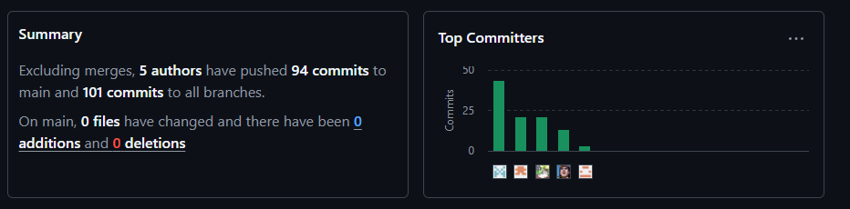

<p align="center">
  
</p>
<div align="center">

# Universidad Peruana de Ciencias Aplicadas

##  Ingeniería de Software

## Ciclo 05

## Aplicaciones Web -  7468

## 
**Profesor:** Ángel Augusto Velásquez Núñez  
## INFORME DE TRABAJO FINAL
**Startup:** RentallPE  


| Integrante                        | Código     |
| --------------------------------- | ---------- |
| Saravia Huaricancha, Arturo Axel  | U202312447 |
| Cumba Rengifo, Leonardo Raúl      | U202311912 |
| Palomares Andrade, Sean Farith    | U202121947 |
| Pérez Tuesta, Gabriel             | U202321281 |
| Torrejón Navarro, Braulio Rodrigo | U201711828 |

_Septiembre 2025_

</div>

---

## Registro de Versiones del Informe

<div align="center">
<table>
  <thead>
    <tr>
      <th>Versión</th><th>Fecha</th><th>Autor(es)</th><th>Descripción</th>
    </tr>
  </thead>
  <body>
    <tr>
      <td><strong>1.0.0 (TB1)</strong></td>
      <td>10/09/2025</td>
      <td>
          <ul>
       <li>Saravia Huaricancha, Arturo Axel</li>
       <li>Cumba Rengifo, Leonardo Raul</li>
       <li>Palomares Andrade, Sean Farith</li>
       <li>Perez Tuesta, Gabriel</li>
       <li>Torrejon Navarro, Braulio Rodrigo</li>
      </ul>
      </td>
      <td>Capítulo I: Introducción.
       <br>
       Capítulo II: Requirements Elicitation & Analysis
         <br>
        Capítulo III: Requirements Specification
        <br>
        Capítulo IV: Product Design
         <br>
        Capítulo V: Product Implementation, Validation & Deployment
      </td>
      
    </tr>
  </tbody>
</table>
</div>

---

## Project Report Collaboration Insights

El informe se gestiona en el repositorio principal:  
👉 <https://github.com/RentallPe/informe>  
La organización completa está aquí:  
👉 <https://github.com/RentallPe>

A continuación, estadísticas de participación:

<p align="center">
  
</p>

---

## Contenido

- [**Capítulo I: Introducción**]()
  - [1.1 Startup Profile]()
    - [1.1.1 Descripción de la Startup ]()
    - [1.1.2 Perfiles de integrantes del equipo ]()
  - [1.2 Solution Profile ]()
    - [1.2.1 Antecedentes y problemática]()
    - [1.2.2 Lean UX Process ]()
      - [1.2.2.1 Lean UX Problem Statements ]()
      - [1.2.2.2 Lean UX Assumptions]()
      - [1.2.2.3 Lean UX Hypothesis Statements ]()
      - [1.2.2.4 Lean UX Canvas]()
  - [1.3 Segmentos objetivo ]()
- [**Capítulo II: Requirements Elicitation & Analysis**]()
  - [2.1. Competidores](#21-competidores)
    - [2.1.1. Análisis competitivo](#211-análisis-competitivo)
    - [2.1.2. Estrategias y tácticas frente a competidores](#212-estrategias-y-tácticas-frente-a-competidores)
  - [2.2. Entrevistas](#22-entrevistas)
    - [2.2.1. Diseño de entrevistas](#221-diseño-de-entrevistas)
    - [2.2.2. Registro de entrevistas](#222-registro-de-entrevistas)
    - [2.2.3. Análisis de entrevistas](#223-análisis-de-entrevistas)
  - [2.3. Needfinding](#23-needfinding)
    - [2.3.1. User Personas](#231-user-personas)
    - [2.3.2. User Task Matrix](#232-user-task-matrix)
    - [2.3.3. User Journey Mapping](#233-user-journey-mapping)
    - [2.3.4. Empathy Mapping](#234-empathy-mapping)
    - [2.3.5. As-is Scenario Mapping](#235-as-is-scenario-mapping)
  - [2.4. Ubiquitous Language](#24-ubiquitous-language)
- [**Capítulo III: Requirements Specification**]()
  - [3.1. To-Be Scenario Mapping](#31-to-be-scenario-mapping)
  - [3.2. User Stories](#32-user-stories)
  - [3.3. Impact Mapping](#33-impact-mapping)
  - [3.4. Product Backlog](#34-product-backlog)
- [**Capítulo IV: Product Design**]()
- - [4.1. Style Guidelines](#41-style-guidelines)
    - [4.1.1. General Style Guidelines](#411-general-style-guidelines)
    - [4.1.2. Web Style Guidelines](#412-web-style-guidelines)
  - [4.2. Information Architecture](#42-information-architecture)
    - [4.2.1. Organization Systems](#421-organization-systems)
    - [4.2.2. Labeling Systems](#422-labeling-systems)
    - [4.2.3. SEO Tags and Meta Tags](#423-seo-tags-and-meta-tags)
    - [4.2.4. Searching Systems](#424-searching-systems)
    - [4.2.5. Navigation Systems](#425-navigation-systems)
  - [4.3. Landing Page UI Design](#43-landing-page-ui-design)
    - [4.3.1. Landing Page Wireframe](#431-landing-page-wireframe)
    - [4.3.2. Landing Page Mock-up](#432-landing-page-mock-up)
  - [4.4. Web Applications UX/UI Design](#44-web-applications-uxui-design)
    - [4.4.1. Web Applications Wireframes](#441-web-applications-wireframes)
    - [4.4.2. Web Applications Wireflow Diagrams](#442-web-applications-wireflow-diagrams)
    - [4.4.3. Web Applications Mock-ups](#443-web-applications-mock-ups)
    - [4.4.4. Web Applications User Flow Diagrams](#444-web-applications-user-flow-diagrams)
  - [4.5. Web Applications Prototyping](#45-web-applications-prototyping)
  - [4.6. Domain-Driven Software Architecture](#46-domain-driven-software-architecture)
    - [4.6.1. Software Architecture Context Diagram](#461-software-architecture-context-diagram)
    - [4.6.2. Software Architecture Container Diagrams](#462-software-architecture-container-diagrams)
    - [4.6.3. Software Architecture Components Diagrams](#463-software-architecture-components-diagrams)
  - [4.7. Software Object-Oriented Design](#47-software-object-oriented-design)
    - [4.7.1. Class Diagrams](#471-class-diagrams)
    - [4.7.2. Class Dictionary](#472-class-dictionary)
  - [4.8. Database Design](#48-database-design)
- [**Capítulo V: Product Implementation, Validation & Deployment**]()
  - [5.1 Software Configuration Management](#51-software-configuration-management)
    - [5.1.1 Software Development Environment Configuration](#511-software-development-environment-configuration)
    - [5.1.2. Source Code Management](#512-source-code-management)
    - [5.1.3. Source Code Style Guide \& Conventions.](#513-source-code-style-guide--conventions)
    - [5.1.4. Software Deployment Configuration.](#514-software-deployment-configuration)
    - [5.2. Landing Page, Services \& Applications Implementation.](#52-landing-page-services--applications-implementation)
      - [5.2.1. Sprint 1](#521-sprint-1)
        - [5.2.1.1. Sprint Planning 1.](#5211-sprint-planning-1)
        - [5.2.1.2. Aspect Leaders and Collaborators.](#5212-aspect-leaders-and-collaborators)
        - [5.2.1.3. Sprint Backlog 1.](#5213-sprint-backlog-1)
        - [5.2.1.4. Development Evidence for Sprint Review.](#5214-development-evidence-for-sprint-review)
        - [5.2.1.5. Execution Evidence for Sprint Review.](#5215-execution-evidence-for-sprint-review)
        - [5.2.1.6. Services Documentation Evidence for Sprint Review.](#5216-services-documentation-evidence-for-sprint-review)
        - [5.2.1.7. Software Deployment Evidence for Sprint Review.](#5217-software-deployment-evidence-for-sprint-review)
        - [5.2.1.8. Team Collaboration Insights during Sprint.](#5218-team-collaboration-insights-during-sprint)
  - [Conclusiones y recomendaciones](#conclusiones-y-recomendaciones)
    - [Conclusiones](#conclusiones)
    - [Recomendaciones](#recomendaciones-1)

---

## Student Outcome

| Criterio Específico                                                                                                                                  | Acciones Realizadas                                                                                                                                                                                                                                                                                                                                                                                                      | Conclusiones                                                                                                                                                                                                                                                                                                                                                                                                                                                                                                                                                                                                                                                                                                                                                                                                                               |
| ---------------------------------------------------------------------------------------------------------------------------------------------------- | ------------------------------------------------------------------------------------------------------------------------------------------------------------------------------------------------------------------------------------------------------------------------------------------------------------------------------------------------------------------------------------------------------------------------ | ------------------------------------------------------------------------------------------------------------------------------------------------------------------------------------------------------------------------------------------------------------------------------------------------------------------------------------------------------------------------------------------------------------------------------------------------------------------------------------------------------------------------------------------------------------------------------------------------------------------------------------------------------------------------------------------------------------------------------------------------------------------------------------------------------------------------------------------ |
| Trabaja en equipo para proporcionar liderazgo en forma conjunta | TB1: Arturo Saravia: Ayudé en la relización de la landing page y del documento <br> <br> TB1: Braulio Torrejon: Apoyo de los mockups y wireframes y prototyping del capitulo 4 <br> <br>TB1 Leonardo Cumba: He desarrollado el capitulo 2, 4 y 5 <br><br> TB1 Gabriel Perez: He desarrollado el capitulo 3<br><br>TB1 Sean Palomares: Apoye en la realizacion del capítulo 4, landing page, y web application wireframes | El equipo llevó a cabo una amplia gama de actividades para comunicar de manera efectiva las ideas y resultados del proyecto de ingeniería. Esto incluyó la realización de entrevistas, la elaboración de Statements y Hypothesis Statements como parte del proceso Lean UX, la creación de User Personas y el mapeo de la experiencia del usuario. Además, se realizó un análisis competitivo, se desarrollaron User Stories y se establecieron estrategias frente a competidores. Se utilizaron herramientas visuales como Lean UX Canvas y Style Guidelines, y se llevaron a cabo actividades como Empathy Mapping para comprender las necesidades de los usuarios. Todo esto se complementó con la creación de Landing Page y el diseño de interfaces de usuario para transmitir la propuesta de valor del proyecto de manera efectiva. |
| Crea un entorno colaborativo e inclusivo, establece metas, planifica tareas y cumple objetivos.                                                                                      | TB1: Arturo Saravia: proporcioné materiales y apoyo en la realización del documento <br> <br> TB1: Braulio Torrejon: Proporcione información sobre las herramientas a usar <br> <br>TB1 Leonardo Cumba: He desarrollado el capitulo 2, 4 y 5 <br><br> TB1 Gabriel Perez: He desarrollado el capitulo 3 <br><br> TB1 Sean Palomares: He logrado colaborar en el desarrollo de la landing page. Además de del capítulo 4.  | El equipo llevó a cabo una amplia gama de actividades para comunicar de manera efectiva las ideas y resultados del proyecto de ingeniería. Tras la realizacion de todos los capitulos del informe se pudo lograr y complementar para la creación de Landing Page y el diseño de interfaces de usuario para transmitir la propuesta de valor del proyecto de manera efectiva.                                                                                                                                                                                                                                                                                                                                                                                                                                                               |


---

# Capítulo I: Introducción

## 1.1 Startup Profile

### 1.1.1. Descripción de la Startup

RentalPE es una startup dedicada al desarrollo de software, enfocada en encontrar soluciones innovadoras para los desafíos de remodelación y monitoreo de espacios comerciales mediante integración de IoT. Nos especializamos en diseñar productos a medida, trabajando codo a codo con nuestros clientes para entender sus necesidades y traducirlas en sistemas eficientes, escalables y de alto impacto.

### 1.1.2. Perfiles de integrantes del equipo

| Nombre Completo del integrante  | Descripcion de Carrera                                                                                                                                      | Fotografía                                                                                                                                                                                                                        | Conocimientos y Habilidades a apuntar                                                                                                                                                                        |
| ------------------------------- | ----------------------------------------------------------------------------------------------------------------------------------------------------------- | --------------------------------------------------------------------------------------------------------------------------------------------------------------------------------------------------------------------------------- | ------------------------------------------------------------------------------------------------------------------------------------------------------------------------------------------------------------ |
| Sean Farith Palomares Andrade   | Ingeniería de Software                                                                                                                                      |                                                                                                                                                                                               | Tengo conocimiento en lenguajes como C#, C++, Python y bases de datos en MySQL. <br> Disfruto colaborar en equipo, compartir ideas y contribuir con una visión común para alcanzar los objetivos propuestos. |
| Perez Tuesta Gabriel            | Ingeniería de Software<br> 5to Ciclo<br>2024-2<br>Universidad Peruana de Ciencias Aplicadas                                                                 |                                                                           | - Conocimientos de lenguajes de programación html, css y Javascript.<br>- Contribución en equipo y responsabilidad.                                                                                          |
| Cumba Rengifo Leonardo Raul     | Ingeniería de Software<br> 5to Ciclo<br>2023-2<br>Universidad Peruana de Ciencias Aplicadas                                                                 |                                                                                                                                                                               | Estudiante de Ingeniería de Software que quiere enfocarse en backend o en DBA. En la actualidad me gustaria especialiarse en DBA                                                                             |
| Saravia Huaricancha Arturo Axel | Ingeniería de Software<br> 5to Ciclo<br>2023-1<br>Universidad Peruana de Ciencias Aplicadas                                                                 |                                                                                                                                                                                                     | Estudiante de ing. de software que quiere dedicarse al desarrollo de juegos y apps web                                                                                                                       |
| Torrejon Navarro Braulio        | Soy un estudiante de 5nto ciclo de la carrera de Ingenieria de Software. Tengo interes en lo que es aprender nuevas herramientas para proyectos personales. |  | Poseo conocimiento en los lenguajes de: C++, Python, C#, Genexus y estuve 1 año en practicas pre profesionales siendo QA, soy una persona que estoy listo a trabajar bajo presión y con mucho compañerismo.  |

## 1.2 Solution Profile

### 1.2.1 Antecedentes y problemática

Uso de la técnica The 5'W's w Y 2`H´s

##### **What**

El problema al que se enfrentan propietarios y empresarios radica en la falta de conocimiento respecto a la planificación y ejecución de la remodelación de sus locales (viviendas, restaurantes, oficinas, inmobiliarias). Esta situación da lugar a una serie de problemas, entre los que se incluyen el incremento de los costes, los retrasos en los plazos de entrega y el estrés asociado. Además, se evidencia la ausencia de un proceso estructurado de asesoría para la integración de soluciones de IoT que aporten monitoreo y eficiencia.

##### **Who**

Dueños de locales comerciales como restaurantes, tiendas, oficinas,inmobiliarias, etc. Ya sean empresarios o emprendedores que cuentan con espacios físicos a reformar y que buscan maximizar el valor de reventa mediante mejoras inteligentes (ioT).

##### **When**

En la fase previa al comienzo de la obra, al diseñar el proyecto. También se considera durante la ejecución de la misma, especialmente antes de las etapas críticas de la construcción, o antes de la venta u alquiler para aumentar el atractivo y plusvalía del inmueble.

##### **why**

La ausencia de planificación, la improvisación y la falta de conocimiento en cuanto a permisos y normativa legal pueden resultar en obras de ejecución deficiente, costes ocultos (10-15 % de imprevistos no contemplados) y riesgos legales o de seguridad. La integración de la tecnología de IoT (Internet de las Cosas) tiene el potencial de incrementar el valor de la propiedad en un 15 %, al tiempo que optimiza la eficiencia energética.

##### **where**

Principalmente en Lima Metropolitana y las capitales regionales de mayor dinamismo comercial (Miraflores, San Isidro, Surco, Arequipa, Trujillo, Piura, entre otras), donde abundan restaurantes, tiendas, oficinas y viviendas destinadas a reventa o alquiler. Son zonas con alta rotación de locales, presiones de valorización inmobiliaria y normativas municipales estrictas; el mercado de remodelaciones es activo pero carece de servicios integrales que combinen planificación, gestión de obra y monitoreo IoT.

##### **How**

En la actualidad, el proceso de remodelación se lleva a cabo de manera manual e improvisada. Generalmente, se inicia sin un plan claro o diseño inicial, se contrata mano de obra informal o profesionales sin experiencia específica y se deja la integración de IoT al azar. El cliente adquiere dispositivos dispersos sin conocimiento sobre cómo instalarlos o conectarlos entre sí, lo que resulta en obras desordenadas, múltiples cambios de alcance durante la ejecución y frecuentes cuellos de botella técnicos.

##### **How much**

Los proyectos de remodelación necesitan un fondo de contingencia del 10-15 % del presupuesto inicial para imprevistos. Los retrasos en plazos pueden ser de semanas o meses. Además, la adopción de soluciones IoT puede incrementar el valor de la propiedad en un 15 %. El mercado peruano de hogares inteligentes movió 410 millones de dólares en 2024 y crece a un ritmo anual cercano al 13 %.

### 1.2.2 Lean UX Process

#### 1.2.2.1. Lean UX Problem Statements.

Los usuarios se enfrentan a remodelaciones caóticas debido a la ausencia de un plan detallado y de un diseño previo en el inicio de las obras. Esta situación provoca sobrecostes que oscilan entre el 10 y el 15 % y retrasos que pueden prolongarse por semanas. Además, la falta de una plataforma integral para monitorear el avance, el presupuesto y la calidad de las obras genera cambios constantes en el alcance y fomenta la utilización de mano de obra informal.

Asimismo, los usuarios desconocen los procedimientos administrativos y las autorizaciones municipales requeridas, exponiéndose a sanciones y paralizaciones. Aunque muestran interés en soluciones IoT para la seguridad y eficiencia energética, carecen de asesoramiento adecuado para su implementación, lo que limita el aprovechamiento de oportunidades de ahorro y plusvalía.

#### 1.2.2.2. Lean UX Assumptions.

### **User Assumptions**

- Los usuarios deberán proporcionar información detallada sobre su proyecto, incluyendo presupuestos, plazos y permisos, para recibir recomendaciones personalizadas y un seguimiento en tiempo real.
- Los usuarios quieren un panel unificado que muestre el progreso de la obra, los costes y las mediciones ambientales (temperatura, humedad, consumo) desde cualquier dispositivo. El texto es muy sencillo.
- Los usuarios adoptarán las recomendaciones de dispositivos IoT (sensores, cámaras, actuadores) siempre y cuando se les proporcione una instrucción clara y detallada sobre qué instalar, dónde hacerlo y cómo proceder con la configuración.
- Los usuarios emplearán las alertas y notificaciones (por ejemplo, recordatorios de inspecciones, cambios de alcance) como guía para la toma de decisiones oportunas y la prevención de imprevistos. Por favor, proceda con el proceso de acuerdo a las siguientes indicaciones.
  
### **User Outcome**

- Los usuarios logran planificar y gestionar sus proyectos de remodelación con mayor precisión, reduciendo los errores y sobrecostes asociados a la falta de planificación.
- Los usuarios pueden visualizar en tiempo real el avance, los costos y las condiciones ambientales del proyecto desde cualquier dispositivo, aumentando su control y confianza.
- Los usuarios integran y configuran con éxito los dispositivos IoT recomendados, aprovechando sus beneficios en seguridad, eficiencia energética y sostenibilidad.
- Los usuarios reaccionan proactivamente ante alertas y notificaciones, lo que reduce retrasos, evita imprevistos y mejora la toma de decisiones durante la obra.

### **Business Assumptions**

- Existe un segmento considerable de propietarios de locales y viviendas dispuestos a pagar una suscripción o tarifa única por una plataforma integral de remodelación y monitoreo de IoT (Internet de las Cosas).
- En el ámbito de la gestión de proyectos, se evidencia la necesidad de establecer alianzas estratégicas con actores claves del sector, tales como arquitectos, contratistas y proveedores de dispositivos IoT. Esta medida se presenta como una oportunidad para optimizar los recursos financieros y ofrecer paquetes de servicios más competitivos.
- Se implementará un modelo premium (listas de verificación y guías básicas gratuitas; asesoramiento y supervisión avanzados de pago) para facilitar la captación de usuarios y fomentar la conversión a planes premium.
- Las campañas digitales, que incluyen SEO, redes sociales, alianzas con inmobiliarias y ferreterías, tienen como objetivo reducir el CAC en relación con el LTV estimado de cada cliente
- La infraestructura en la nube y la automatización de procesos contribuirán a reducir los costos operativos, permitiendo márgenes saludables incluso con planes asequibles.


### **Business Outcome**

- Incremento del 10–20 % en la captación de propietarios de locales y viviendas durante los primeros seis meses gracias al modelo freemium y las campañas digitales.
- Reducción del CAC (Costo de Adquisición de Cliente) en un 25 % mediante estrategias SEO, alianzas con inmobiliarias y promoción en redes sociales.
- Conversión del 30 % de los usuarios gratuitos a planes premium durante el primer año de operación.
- Incremento del margen operativo mediante la automatización de procesos y el uso de infraestructura en la nube, reduciendo los costos fijos en al menos un 15 %.
- Establecimiento de al menos tres alianzas estratégicas con contratistas, arquitectos y proveedores IoT durante la fase inicial, fortaleciendo la oferta de valor y reduciendo tiempos de implementación.
- Aumento del valor de vida del cliente (LTV) a través de renovaciones de suscripción, servicios complementarios y actualizaciones tecnológicas en IoT.
- Mejora en la eficiencia del flujo de proyectos, reflejada en una reducción promedio del 20 % en tiempos de entrega y en incidencias reportadas por los usuarios.

### **Feature Outcome**

#### Flujo de planificación con plantillas y checklists automatizadas

- Los propietarios completan la planificación inicial de su proyecto en un promedio de 3 días o menos.
- El número de tareas imprevistas durante la ejecución se reduce en al menos 10 %.
- El tiempo promedio de entrega del proyecto disminuye en 20 % respecto al promedio histórico.

#### Tablero unificado con seguimiento en tiempo real (avance, presupuesto, condiciones IoT)

- Los usuarios consultan el tablero al menos 3 veces por semana.
- El tiempo promedio de reacción ante desviaciones de presupuesto o avance se reduce en 30 %.
- Se detecta una reducción del 30 % en los cambios de alcance no planificados.

#### Módulo de recomendaciones para instalación de dispositivos IoT

- 50 % de los proyectos activos integran al menos un dispositivo IoT recomendado.
- Los proyectos con IoT muestran una mejora del 15 % en consumo energético.
- 70 % de los usuarios califican la guía de instalación como “útil” o “muy útil”.

#### Módulo de trámites municipales automatizados

- 80 % de los usuarios que inician obras registran sus permisos correctamente en la plataforma.
- Las paralizaciones por sanciones disminuyen en más del 70 %.
- Los usuarios completan el flujo de trámites en menos de 5 días hábiles.

#### Planes Free y Premium

- 20 % de conversión de usuarios gratuitos a plan premium en los primeros tres meses.
- 75 % de retención de usuarios premium después del primer mes.
- Incremento del 25 % en el ingreso promedio por usuario (ARPU).

#### 1.2.2.3. Lean UX Hypothesis Statements.

- Creemos que si ofrecemos a los propietarios un flujo de planificación paso a paso con plantillas y checklists automatizadas, entonces reducirán los sobrecostos por imprevistos en al menos un 10 % y acortarán los retrasos en un 20 %.
- Creemos que si proporcionamos un tablero unificado con seguimiento en tiempo real de avance, presupuesto y condiciones ambientales (sensores de IoT), entonces los usuarios tomarán decisiones más rápidas y reducirán los cambios de alcance improvisados en un 30 %.
- Creemos que si incluimos recomendaciones detalladas sobre qué dispositivos IoT instalar y cómo configurarlos, entonces al menos el 50 % de los usuarios incorporará soluciones inteligentes en su remodelación, mejorando la eficiencia energética en un 15 %.
- Creemos que si integramos en la plataforma un módulo de trámites municipales con guías paso a paso y recordatorios automáticos, entonces disminuirá en un 80 % el inicio de obras sin permiso, evitando sanciones y paralizaciones.
- Creemos que si ofrecemos un plan gratuito con funcionalidades básicas (checklists y tutoriales) y un plan premium con asesoría personalizada y monitoreo avanzado, entonces alcanzaremos una tasa de conversión del 20 % de usuarios free a paid dentro de los primeros tres meses.


#### 1.2.2.4. Lean UX Canvas.


## 1.3. Segmentos objetivo.

**1) Propietarios de locales comerciales (restaurantes, tiendas, oficinas, otros)**

Dueños o administradores de locales (PYMES y cadenas chicas) que buscan remodelar y operar con mayor eficiencia: control de costos y pagos, cumplimiento (facturación), y monitoreo de consumo/ambiente para reducir gastos y mejorar la experiencia del cliente/empleado.

**Características demográficas**

- Ubicación: Lima Metropolitana y capitales regionales (zonas con alta densidad de comercio y oficina).
- Tamaño: micro y pequeñas empresas; 1–5 locales (restaurantes/cafeterías/retail/otros), oficinas de 10–100 personas.
- Roles decisores: dueño/gerente general, administrador de tienda, facility/office manager, contabilidad/finanzas.

**Necesidades clave**

- Control de obra y costos: presupuestos comparables, pagos y facturas electrónicas simples.
- Visibilidad operativa: panel en tiempo real de energía/ambiente/seguridad (IoT), umbrales y alertas.
- Cumplimiento y experiencia: contratos/firma digital, reportes para auditoría e indicadores de confort (IAQ) que impactan en ventas y productividad.

---

**2) Propietarios de viviendas con fines de reventa o alquiler**

Personas/familias e inversionistas pequeños que remodelan para vender mejor o alquilar más rápido y a mejor renta: les interesa el tiempo-a-mercado, la estética funcional y el consumo eficiente (para subir valor y bajar gastos del inquilino).

**Características demográficas**

- Ubicación: Lima Metropolitana (distritos con mercado de compra-venta y arriendo activo) y ciudades universitarias/turísticas.
- Perfil económico: ingresos medios/medios-altos; 1–3 unidades en propiedad.
- Experiencia digital: usan portales inmobiliarios (búsqueda, pricing), contactan profesionales por apps/redes.

**Necesidades clave**

- Plan de remodelación “lista para publicar”: paquete claro (alcances, tiempos, costos) con antes/después y checklist de materiales.
- Comparación de presupuestos y pagos: cotizaciones normalizadas, hitos de obra, pagos en línea y comprobantes.
- Atributos que suben valor: cocina/baño, iluminación/ventilación, eficiencia energética (artefactos/IAQ básico), y reportes para anuncios (consumo estimado, mejoras certificables).

# Capítulo II: Requirements Elicitation & Analysis

## 2.1. Competidores

**1\) Procore** – suite integral para gestión de proyectos, costos y facturación

- **Qué ofrece:** gestión de proyectos y de campo, control de costos, gestión y aprobación de **facturas** y **cobros** en un solo lugar; integra proveedores y subcontratistas

- **Fortaleza:** plataforma muy completa y adoptada por contratistas medianos/grandes; workflows financieros maduros.

- **Brecha vs. tu propuesta:** Procore no es nativo IoT; la analítica de consumo/IAQ suele lograrse con integraciones externas.

**2\) Autodesk Construction Cloud (ACC / Build)** – gestión colaborativa con foco en **cost management**

- **Qué ofrece:** control de **costos** centralizado en la nube, permisos granulares, colaboración con dueños y proveedores; flujo de proyecto de punta a punta.

- **Fortaleza:** muy fuerte en documentación, trazabilidad y costos (nativo de Autodesk).
- **Brecha:** no es una plataforma IoT end-to-end para energía/IAQ; requiere ecosistema adicional para telemetría.

**3\) Buildertrend** – orientado a **remodeladores** y constructores residenciales

- **Qué ofrece:** gestión completa de remodelaciones, **portal del cliente** con actualizaciones, comunicación y pagos; foco en residencial.

- **Fortaleza:** experiencia del cliente final (portal/actualizaciones) y funcionalidades específicas para remodelación

- **Brecha:** no incluye monitoreo IoT/energético nativo para locales comerciales.

**4\) Fieldwire (by Hilti)** – coordinación en obra y gestión de RFIs/tareas

- **Qué ofrece:** coordinación en terreno, RFIs integradas con planos y tareas, móvil-first; bueno para equipos en campo.

- **Fortaleza:** simple y robusto en ejecución diaria en obra.

- **Brecha:** foco en operación de obra; finanzas/IoT no son su centro.

### 2.1.1. Análisis competitivo

# Competitive Analysis Landscape

**¿Por qué llevar a cabo este análisis?**  
Comparar la propuesta integral (remodelación + pagos/facturación + IoT/energía/IAQ + reportes) con suites líderes para detectar ventajas, brechas y oportunidades.

**Objetivo / Pregunta guía**  
¿Cómo diferenciarnos para pymes comerciales y propietarios residenciales al combinar **gestión del proyecto + cobros/facturas + monitoreo IoT/energía** en una sola plataforma?

---

## Perfil

### Overview

| (coloca logos en el encabezado) | **Tu startup**                                                                                                                                                     | **Procore**                                                                                                                         | **Autodesk Build (ACC)**                                                                                               | **Buildertrend**                                                                                              |
| ------------------------------- | ------------------------------------------------------------------------------------------------------------------------------------------------------------------ | ----------------------------------------------------------------------------------------------------------------------------------- | ---------------------------------------------------------------------------------------------------------------------- | ------------------------------------------------------------------------------------------------------------- |
| **Descripción breve**           | Plataforma para **remodelación y operación** de locales y viviendas (renta/venta): backlog, **pagos y facturas**, **IoT energía/IAQ**, alertas y **reportes/ESG**. | Suite integral de construcción con **Invoice/Payment Applications** y **Procore Pay** para orquestar cobros/pagos con trazabilidad. | Plataforma colaborativa con **Cost Management** para centralizar y dar visibilidad a la salud financiera del proyecto. | Software para **residencial y remodelación** con **Client Portal** y **pagos** integrados, orientado a pymes. |

### Ventaja competitiva / ¿Qué valor ofrece?

|               | **Tu startup**                                                                                                                               | **Procore**                                                                                                   | **Autodesk Build (ACC)**                                                                          | **Buildertrend**                                                                                                  |
| ------------- | -------------------------------------------------------------------------------------------------------------------------------------------- | ------------------------------------------------------------------------------------------------------------- | ------------------------------------------------------------------------------------------------- | ----------------------------------------------------------------------------------------------------------------- |
| **Propuesta** | **Todo-en-uno**: obra + **pagos/facturas** + **IoT/energía** + **reportes ESG/IA** para **comercial ligero** y **residencial de inversión**. | Cadena financiera robusta (invoicing, **pay apps**, **Procore Pay**, **lien waivers**) y adopción enterprise. | **Costos** integrado al flujo ACC (Docs + móvil); control de riesgo y visibilidad de presupuesto. | **Experiencia del cliente** (portal) y flujo de **remodelación residencial** con pagos y sincronización contable. |

### Mercado objetivo

|               | **Tu startup**                                                                   | **Procore**                                                                                  | **Autodesk Build (ACC)**                                                      | **Buildertrend**                             |
| ------------- | -------------------------------------------------------------------------------- | -------------------------------------------------------------------------------------------- | ----------------------------------------------------------------------------- | -------------------------------------------- |
| **Segmentos** | PYMES (retail/foodservice/oficinas) y propietarios residenciales (1–3 unidades). | GC/constructores medianos-grandes; owners con necesidades de control financiero/contractual. | Empresas en ecosistema Autodesk que buscan centralizar **costos** en la nube. | Home builders y remodeladores residenciales. |

### Estrategias de marketing

|                  | **Tu startup**                                                                                               | **Procore**                                                                | **Autodesk Build (ACC)**                                                   | **Buildertrend**                                                    |
| ---------------- | ------------------------------------------------------------------------------------------------------------ | -------------------------------------------------------------------------- | -------------------------------------------------------------------------- | ------------------------------------------------------------------- |
| **Go-to-market** | Casos de **ahorro energético + ROI** de remodelación; alianzas con IoT/financieras; calculadoras y reportes. | Contenido y casos de pago/invoicing para reducción de fricción financiera. | Demos y contenidos de **Cost Management** y su integración con Docs/móvil. | Demos, **Client Portal** y materiales de pagos/finanzas para pymes. |

---

## Perfil de Producto

### Productos & Servicios

|                   | **Tu startup**                                                                                               | **Procore**                                                                                                | **Autodesk Build (ACC)**                                                               | **Buildertrend**                                                               |
| ----------------- | ------------------------------------------------------------------------------------------------------------ | ---------------------------------------------------------------------------------------------------------- | -------------------------------------------------------------------------------------- | ------------------------------------------------------------------------------ |
| **Módulos clave** | Gestión de obra; **pagos/facturación electrónica**; **IoT energía/IAQ**; **alertas**; reportes/ESG e **IA**. | **Invoice/Payment Applications** + **Procore Pay** (pagos GC-subs; workflows de pagos y **lien waivers**). | **Cost Management** (presupuestos, cambios, visibilidad financiera) integrado a Build. | **Client Payments** con **invoicing** y opciones de cobro + **Client Portal**. |

### Precios & Costos _(referencial)_

|            | **Tu startup**                                           | **Procore**                                            | **Autodesk Build (ACC)**                                                          | **Buildertrend**                                          |
| ---------- | -------------------------------------------------------- | ------------------------------------------------------ | --------------------------------------------------------------------------------- | --------------------------------------------------------- |
| **Modelo** | Definir **tiers** por nº de proyectos/sensores/usuarios. | Precio no público; **Procore Pay** como add-on/región. | Suscripción de **Autodesk Build**; Cost Management incluido en el producto Build. | Precio bajo demo; **pagos** con comisión por transacción. |

### Canales de distribución (Web / Móvil)

|             | **Tu startup**                                          | **Procore**                                            | **Autodesk Build (ACC)**                 | **Buildertrend**                             |
| ----------- | ------------------------------------------------------- | ------------------------------------------------------ | ---------------------------------------- | -------------------------------------------- |
| **Canales** | Web + móvil (push para alertas; descargas de reportes). | Web + apps; portal de colaboración y pagos integrados. | Web + **ACC mobile app** (Docs + Build). | Web + app y **Client Portal** para clientes. |

---

## Análisis SWOT

### Fortalezas

|               | **Tu startup**                                                                                                                                     | **Procore**                                                                            | **Autodesk Build (ACC)**                                                    | **Buildertrend**                                                                  |
| ------------- | -------------------------------------------------------------------------------------------------------------------------------------------------- | -------------------------------------------------------------------------------------- | --------------------------------------------------------------------------- | --------------------------------------------------------------------------------- |
| **Strengths** | **Integración nativa**: obra + **pagos/facturas** + **IoT/energía** + reportes/ESG, enfocada en pymes/comercial ligero y residencial de inversión. | Cadena **financiera** madura: pay apps, **Procore Pay**, **lien waivers** automáticos. | **Cost Management** centralizado con alta visibilidad y control de riesgos. | Foco **residencial/remodelación** y **experiencia del cliente** (portal + pagos). |

### Debilidades

|                | **Tu startup**                                                          | **Procore**                                                | **Autodesk Build (ACC)**                                | **Buildertrend**                                                 |
| -------------- | ----------------------------------------------------------------------- | ---------------------------------------------------------- | ------------------------------------------------------- | ---------------------------------------------------------------- |
| **Weaknesses** | Menor reconocimiento de marca; requiere despliegue/soporte de sensores. | Complejidad enterprise; **IoT/energía** vía integraciones. | Menor foco en IoT/IAQ nativo; depende de integraciones. | Enfoque residencial; menos profundidad en costos enterprise/IoT. |

### Oportunidades

|                   | **Tu startup**                                                                                                | **Procore**                                     | **Autodesk Build (ACC)**                                     | **Buildertrend**                                            |
| ----------------- | ------------------------------------------------------------------------------------------------------------- | ----------------------------------------------- | ------------------------------------------------------------ | ----------------------------------------------------------- |
| **Opportunities** | **Ahorro energético verificable** + facturación local + reportes ESG para ventas/alquiler y margen operativo. | Integraciones IoT/ESG para clientes enterprise. | Extender analítica/ML en costos e integraciones energía/ESG. | Upsell con finanzas/pagos y automatización de comunicación. |

### Amenazas

|             | **Tu startup**                                                          | **Procore**                                    | **Autodesk Build (ACC)**                                  | **Buildertrend**                                                             |
| ----------- | ----------------------------------------------------------------------- | ---------------------------------------------- | --------------------------------------------------------- | ---------------------------------------------------------------------------- |
| **Threats** | Incumbentes pueden empaquetar **IoT** con partners; presión de precios. | Saturación enterprise; ciclos de venta largos. | Competencia por bundles integrados (ecosistema Autodesk). | Plataformas todo-en-uno que fortalezcan **pagos** y finanzas en residencial. |

# Strategy

Las estrategias de **RentAllPE** se centran en consolidar una plataforma integral que combine la gestión de remodelaciones con el monitoreo inteligente mediante IoT. Para ello, se implementará un modelo de negocio premium que permita captar usuarios a través de funcionalidades básicas gratuitas (checklists, plantillas y guías) y fomentar su conversión hacia planes premium con asesoría personalizada y seguimiento avanzado. Paralelamente, se establecerán alianzas estratégicas con arquitectos, contratistas y proveedores de dispositivos inteligentes para ofrecer paquetes de servicios integrales. En el ámbito digital, se priorizará una estrategia de marketing basada en SEO, redes sociales y colaboraciones con inmobiliarias y ferreterías locales, con el fin de aumentar la visibilidad, reducir el costo de adquisición de clientes (CAC) y elevar el valor promedio por usuario (ARPU) en el mediano plazo.


## **2.2. Entrevistas**

### **2.2.1. Diseño de entrevistas**

**Preguntas:**

**Propietarios de locales comerciales (restaurantes, tiendas, oficinas, otros)**

Calentando

Para ubicarnos, ¿cómo es tu local hoy? (tipo de negocio, tamaño, zona)

¿Qué parte del local “te habla” primero cuando piensas en mejorar algo?

Historia reciente

3. Cuéntame la última vez que hiciste una mejora o remodelación. ¿Cómo empezó la idea?

4. ¿Qué te hizo decir “ya, ahora sí lo hacemos”? (queja, inspección, oportunidad, moda, etc.)

5. ¿Cómo te organizaste con presupuestos y proveedores? ¿Qué te funcionó y qué no?

Operación del día a día

6. En una semana normal, ¿qué miras para saber si todo va bien? (ventas, consumo, ambiente, ruido, etc.)

7. ¿Alguna vez te llegó una sorpresa en el local (temperatura, equipos, seguridad)? ¿Cómo te enteraste y qué hiciste?

Pagos y papeles

8. ¿Cómo llevas pagos y comprobantes con proveedores? ¿Dónde se complica o se demora?

Tecnología / ayudas

9. Si tuvieras una alerta ideal en el celular, ¿qué debería decirte y qué te gustaría poder hacer al toque?

10. Imagina una app que te ayude con cotizaciones, avances y pagos: ¿qué pantalla o botón no podría faltar?

Cierre

11. Si mañana vuelves a remodelar, ¿qué tres cosas harías distinto para que sea más liviano?

12. ¿Hay algo que evitarías a toda costa? (proveedores, procesos, horarios, permisos, etc.)

**Propietarios de viviendas**

Calentando

¿Qué tipo de propiedad manejas y en qué zona? (solo para contexto)

¿Qué te gusta y qué no te gusta de la vivienda tal como está hoy?

Historia reciente

3. Cuéntame la última remodelación que hiciste para vender o alquilar. ¿Cómo nació la idea?

4. ¿Cuál fue el objetivo principal: vender mejor, alquilar más rápido, resolver un problema…?

5. ¿Cómo comparaste presupuestos? ¿Te quedó alguna duda o aprendizaje de esa parte?

Publicación y valor

6. Cuando publicaste, ¿qué pruebas te ayudaron más? (fotos antes/después, mejoras, consumo estimado, etc.)

7. ¿Cómo decides el precio de alquiler/venta? ¿Qué señales miras y dónde?

Pagos y coordinación

8. ¿Cómo manejaste pagos y comprobantes con maestros/contratistas? ¿Qué parte te quitó más tiempo?

9. ¿Hubo retrasos o cambios de último minuto? ¿Cómo afectó tu fecha de publicación o el ROI?

Tecnología / ayudas

10. Si pudieras ver en el celular consumo estimado o confort para incluirlo en el aviso, ¿cómo te gustaría que se muestre?

11. Pensando en una app que centralice cotizaciones, avances, pagos y documentos, ¿qué te haría decir “vale la pena”?

Cierre

12. Para tu próxima remodelación, ¿qué atajos te gustaría tener y qué dolores preferirías no repetir?

**2.2.2. Registro de Entrevistas**

**Segmento 1: Propietarios de Locales**

#### Entrevista 1:

**Nombre y Apellido:** David Quispe

**Edad:** 19 años

**Distrito:** Pueblo libre

<p align="center">
  
</p>

https://upcedupe-my.sharepoint.com/:v:/g/personal/u202311912_upc_edu_pe/EYRGg-zJaV9KgiqWyssQoNcBSjgyt1qNAcvgQW95HD_PuA?nav=eyJyZWZlcnJhbEluZm8iOnsicmVmZXJyYWxBcHAiOiJTdHJlYW1XZWJBcHAiLCJyZWZlcnJhbFZpZXciOiJTaGFyZURpYWxvZy1MaW5rIiwicmVmZXJyYWxBcHBQbGF0Zm9ybSI6IldlYiIsInJlZmVycmFsTW9kZSI6InZpZXcifX0%3D&e=Dhi2cS

Resumen de la entrevista: Las respuestas indican que su mayor dolor está en la falta de control y visibilidad al operar el espacio: ruidos frecuentes, riesgos de seguridad y incidencias de servicios (p. ej., baños) que se atienden tarde; además, necesita recibos al instante para trámites y prefiere procesos rápidos y sencillos sin perder trazabilidad. Valora una solución que estandarice cotizaciones, centralice pagos y facturación, y ofrezca un panel en tiempo real con alertas (seguridad/consumo) y una bitácora de incidencias con responsables y SLA. Una plataforma como rentallPe cubriría estas brechas, reduciendo pérdidas, mejorando la coordinación con proveedores y acelerando el retorno de su inversión.

#### Entrevista 2:

**Nombre y Apellido:** Patricia Navarro

**Edad:** 50 años

**Distrito:** La Victoria

**Screenshot de la Entrevista:**


**Timelapse:** [Inicio: 00:00, Fin: 04:00]
\*\*Link de la Entrevista: https://upcedupe-my.sharepoint.com/:v:/g/personal/u201711828_upc_edu_pe/EX11GPAnMvhAmiBZrqGizhIBwkXMzUUHZ_FLwu0I-MjqPg?e=OF4nJz&nav=eyJyZWZlcnJhbEluZm8iOnsicmVmZXJyYWxBcHAiOiJTdHJlYW1XZWJBcHAiLCJyZWZlcnJhbFZpZXciOiJTaGFyZURpYWxvZy1MaW5rIiwicmVmZXJyYWxBcHBQbGF0Zm9ybSI6IldlYiIsInJlZmVycmFsTW9kZSI6InZpZXcifX0%3D

**Resumen de la Entrevista:**
Las respuestas de Patricia indica de que le gustaria más seguridad en el lugar donde renta, donde pueda recibir notificaciones en su celular cuando alguien entre en su casa, tambien le gustaria poder recibir rapidamente tramites, lo que mayormente le gustaria poder tener un lugar donde puede revisar sus estados de luz y agua. En resumen, le gustaria seguridad en su hogar y poder verlo todo en su celular porque eso le ahorraria tiempo

**Segmento 2: Propietarios de viviendas**

#### Entrevista 1:

**Nombre y Apellido:** Jhon Chuchon

**Edad:** 25 años

**Distrito:** Miraflores

**Screenshot de la Entrevista:**


**Timelapse:** [Inicio: 00:00, Fin: 04:00]
**Link de la Entrevista: https://upcedupe-my.sharepoint.com/:v:/g/personal/u202321281_upc_edu_pe/EdE0G30LNsxFtmvA4sLmMjUBqM6Uyh9Ti4jvG6Ydb4OTXA?e=11wrVN&nav=eyJyZWZlcnJhbEluZm8iOnsicmVmZXJyYWxBcHAiOiJTdHJlYW1XZWJBcHAiLCJyZWZlcnJhbFZpZXciOiJTaGFyZURpYWxvZy1MaW5rIiwicmVmZXJyYWxBcHBQbGF0Zm9ybSI6IldlYiIsInJlZmVycmFsTW9kZSI6InZpZXcifX0%3D**

**Resumen de la Entrevista:**
Las respuestas de Jhon muestran que su mayor frustración está en la falta de organización durante la remodelación: presupuestos desordenados, retrasos que afectan ingresos y coordinación complicada con contratistas. También valora mucho el impacto de las fotos en la publicación y busca herramientas que le ahorren tiempo y le den claridad en costos y avances. Una solución digital que estandarice cotizaciones, centralice pagos y muestre avances en tiempo real tendría gran valor para él, ya que reduciría pérdidas económicas y aceleraría el retorno de su inversión.

#### Entrevista 2:

**Nombre y Apellido:** Ivan Antonio Almeida Aguilar

**Edad:** 20 años

**Distrito:** San Miguel

**Screenshot de la Entrevista:**


**Timelapse:** [Inicio: 00:00, Fin: 20:00]
**Link de la Entrevista: https://upcedupe-my.sharepoint.com/:v:/g/personal/u202312447_upc_edu_pe/ETO9TVQM9H5ImqV2ll_rb8sBTUedwKmZv24KgIixZRvHMA?e=yf7fKD&nav=eyJyZWZlcnJhbEluZm8iOnsicmVmZXJyYWxBcHAiOiJTdHJlYW1XZWJBcHAiLCJyZWZlcnJhbFZpZXciOiJTaGFyZURpYWxvZy1MaW5rIiwicmVmZXJyYWxBcHBQbGF0Zm9ybSI6IldlYiIsInJlZmVycmFsTW9kZSI6InZpZXcifX0%3D**

**Resumen de la Entrevista:**
El entrevistado, Luan Almeida (20 años), administra un Airbnb desde hace medio año. Señaló que actualmente enfrentan baja demanda y que sus remodelaciones fueron hechas de forma improvisada, con problemas en instalaciones y acabados. Explicó que el manejo de presupuestos resulta complejo por imprevistos frecuentes, y que los pagos a contratistas son informales, sin comprobantes ni registro.

Resaltó la importancia de las imágenes para atraer clientes, aunque también enfrentan dificultades para fijar precios adecuados. Entre los principales problemas mencionó los retrasos por cambios de último momento y la falta de compromiso de trabajadores. Finalmente, destacó la necesidad de herramientas digitales que integren control de consumos, pagos centralizados y un catálogo de materiales y servicios que simplifique la gestión de remodelaciones.

**2.2.3. Análisis de entrevistas**

#### Propietarios de Locales

En las entrevistas de este segmento, los propietarios recalcan que sus principales problemas están relacionados con la falta de control y visibilidad en la operación diaria de los espacios. Señalan incidencias constantes como ruidos, problemas de seguridad y servicios que se atienden tarde. También manifiestan la necesidad de contar con procesos rápidos, simples y trazables, donde puedan obtener comprobantes al instante y llevar un registro ordenado. Una solución digital como RentallPE sería de gran ayuda siempre que permita:

Panel en tiempo real con alertas de seguridad y consumo.

Bitácora de incidencias con responsables y tiempos de resolución (SLA).

Estandarización de cotizaciones.

Centralización de pagos y facturación.

Visibilidad clara del estado de los espacios.

#### Propietarios de Viviendas

En este segmento, los entrevistados coinciden en que los mayores dolores se encuentran en la desorganización de las remodelaciones, con presupuestos poco claros, sobrecostos por imprevistos y retrasos por cambios de último minuto o falta de compromiso de los trabajadores. También resaltan la importancia de las fotos para atraer clientes y la dificultad de fijar precios adecuados. Además, los pagos suelen manejarse de manera informal, sin comprobantes ni registros claros, lo que complica la gestión.

Las funcionalidades más valoradas para una solución digital serían:

Centralización de pagos y emisión de comprobantes.

Control en tiempo real de avances y consumos (apoyado en IoT).

Catálogo de materiales y “combos” predefinidos para simplificar decisiones.

Gestión más formal de contratistas y remodelaciones.

Organización clara de presupuestos y cronogramas.

## **2.3. Needfinding**

### 2.3.1. User Personas

Para esta sección hemos tomado en cuenta dos User Persona que corresponden a los dos segmentos objetivos nombrados anteriormente: los propietarios de inmuebles y los trabajadores independientes.


### 2.3.2. User Task Matrix

En esta sección se presenta el User Task Matrix, que concentra las tareas que los User Persona (Propietario de Vivienda y Propietario de local) realizan para cumplir sus objetivos.


| **Propietario de Local** |              |                                | **Propietario de Vivienda** |              |                        |
|---------------------------|--------------|--------------------------------|-----------------------------|--------------|------------------------|
| **Tareas**                | **Importancia** | **Frecuencia**                 | **Tareas**                  | **Importancia** | **Frecuencia**         |
| Cobrar el alquiler de los inquilinos | Alta         | Mensual                        | Pagar los servicios básicos (agua, luz, gas, internet) | Alta         | Mensual                |
| Verificar el estado del local (mantenimiento y limpieza) | Alta | Mensual                        | Hacer mantenimiento preventivo de la casa (pintura, reparaciones pequeñas) | Media        | Trimestral / Semestral |
| Gestionar contratos de arrendamiento | Alta         | Al inicio y renovación del contrato | Evaluar mejoras en el hogar (remodelaciones, ampliaciones) | Media        | Ocasional              |
| Solucionar problemas reportados por los inquilinos (fugas, daños) | Alta | Ocasional / Urgente            | Comprar productos para el hogar (electrodomésticos, muebles) | Media        | Ocasional              |
| Evaluar el mercado para ajustar precio de alquiler | Media        | Semestral / Anual              | Administrar el presupuesto familiar | Alta         | Semanal                |
| Garantizar que el local cumpla con normativas legales y de seguridad | Alta | Trimestral / Anual              | Coordinar con proveedores de servicios (gasfiteros, electricistas, limpieza) | Media        | Ocasional              |
| Coordinar con empresas de mantenimiento (limpieza, plomería, seguridad) | Media | Mensual                        | Garantizar la seguridad de la vivienda | Alta         | Diaria                 |
| Administrar pagos de impuestos del local | Alta         | Anual                          | Manejar pagos de impuestos de la propiedad | Alta         | Anual                  |

Al observar la matriz de tareas, se pueden identificar varios puntos clave:

1. Tareas con mayor importancia y frecuencia

Para el Propietario de Local, destacan como más críticas: cobrar el alquiler de los inquilinos, verificar el estado del local, gestionar contratos de arrendamiento y solucionar problemas reportados; todas ellas con importancia alta y frecuencia mensual u ocasional urgente.
Para el Propietario de Vivienda, resaltan las tareas diarias o frecuentes como pagar los servicios básicos, administrar el presupuesto familiar y garantizar la seguridad de la vivienda, que se consideran de alta importancia en su contexto.

2. Principales diferencias

El Propietario de Local centra su gestión en aspectos contractuales, legales y de mantenimiento del inmueble como inversión de arrendamiento.
El Propietario de Vivienda se enfoca en la administración cotidiana del hogar, la seguridad familiar y la sostenibilidad financiera de la vivienda.
La frecuencia también marca una diferencia: mientras el propietario de local tiene tareas más periódicas o asociadas a eventos específicos (renovación de contratos, impuestos, mercado), el propietario de vivienda enfrenta responsabilidades de carácter diario o semanal (pago de servicios, seguridad, presupuesto).

3. Coincidencias

Ambos segmentos deben gestionar pagos de impuestos de forma anual.
En los dos casos existen tareas de mantenimiento y coordinación con servicios externos, aunque en contextos distintos (mantenimiento del local vs. mantenimiento preventivo y proveedores del hogar).
En ambos perfiles se percibe la necesidad de garantizar condiciones de seguridad: el local frente a normativas legales y de protección del inmueble, y la vivienda frente a la seguridad de los ocupantes.

### 2.3.3. User Journey Mapping

Creamos los User Journey Maps con el objetivo de comprender la experiencia de nuestro cliente al utilizar nuestra aplicación. Por ende, cada paso que el cliente realiza se detalla minuciosamente, incluyendo el proceso, los obstáculos encontrados y los pensamientos o emociones que surgen a raíz de ello.

**Segmento 1: Propietarios de Locales**


**Segmento 2: Propietarios de Viviendas**


### 2.3.4. Empathy Mapping
Para el desarrollo de los Empathy Map hemos utilizado la información recopilada en base a nuestros dos User Personas que representan nuestro segmento.

**Segmento 1: Propietarios de Locales**


**Segmento 2: Propietarios de Viviendas**


### 2.4 Ubiquitous Language

| **Término**                    | **Definición**                                                                                         |
| ------------------------------ | ------------------------------------------------------------------------------------------------------ |
| **Propietario de Vivienda**    | Persona que posee una casa o departamento y busca mantenerlo, remodelarlo o alquilarlo.                |
| **Propietario de Local**       | Persona que posee un local comercial y busca optimizar su renta mediante remodelación o mantenimiento. |
| **Propiedad**                  | Activo físico (casa, departamento o local) con atributos como dirección, área, estado y valor.         |
| **Cotización**                 | Presupuesto estimado de remodelación, presentado por un contratista.                                   |
| **Contrato**                   | Documento que formaliza la relación de alquiler o remodelación (incluye fechas y montos).              |
| **Tarea de Mantenimiento**     | Actividad específica de reparación, pintura, plomería o remodelación.                                  |
| **Contratista/Maestro**        | Persona o empresa encargada de ejecutar la obra o mantenimiento.                                       |
| **Pago**                       | Registro de dinero entregado o recibido, ya sea para trabajos o alquileres.                            |
| **Publicación**                | Acción de poner en oferta la propiedad para venta o alquiler.                                          |
| **Avance de Obra**             | Reporte parcial del progreso de los trabajos realizados.                                               |
| **Incidencia**                 | Problema o desperfecto reportado durante el uso o remodelación de la propiedad.                        |
| **Mantenimiento Preventivo**   | Acciones planificadas para evitar problemas futuros en la propiedad.                                   |
| **ROI (Retorno de Inversión)** | Métrica para evaluar el beneficio de una remodelación frente al costo invertido.                       |

# Capítulo III Especificación de requisitos

### 3.1 User Storys

| Epic/Story ID | Título                                     | Descripción                                                                                                                                                                           | Criterios de aceptación                                                                                                                                                                                              | Relacionado con (Epic ID) |
| ------------- | ------------------------------------------ | ------------------------------------------------------------------------------------------------------------------------------------------------------------------------------------- | -------------------------------------------------------------------------------------------------------------------------------------------------------------------------------------------------------------------- | ------------------------- |
| **Landing Page Informativa y Comercial / US01**      | Visualización de servicios de remodelación | Como visitante de la landing page, quiero visualizar rápidamente los tipos de remodelación, para identificar cuál se ajusta mejor a mis necesidades.                                  | **Escenario:** Dado que el usuario ingresa a la web de RentallPe, cuando accede a la sección de servicios, entonces debería visualizar una lista con los planes de remodelación disponibles junto con su descripción y costos.  <br> **Escenario:** Dado que el usuario se encuentra en la página principal, cuando navega hacia la sección de proyectos, entonces debería visualizar un listado con ejemplos de remodelaciones realizadas, incluyendo imágenes y métricas de éxito.   <br> **Escenario:** Dado que el usuario desea conocer más sobre los beneficios de IoT, cuando ingresa a la sección de beneficios, entonces debería visualizar información clara y comprensible sobre ahorro energético, seguridad y sostenibilidad.          |            EP03               |
| **Landing Page Informativa y Comercial / US02**      | Visualización de sección de proyectos      | Como visitante de la landing page, quiero ver ejemplos de proyectos realizados, para tener confianza en la calidad del servicio de remodelación.                                      | **Escenario:** Dado que el usuario está en la página principal, cuando navega a la sección de proyectos, entonces debería visualizar un listado con imágenes, descripciones y métricas de éxito de remodelaciones anteriores.  <br> **Escenario:** Dado que el usuario revisa los proyectos destacados, cuando selecciona uno de ellos, entonces debería visualizar un detalle con fotos, descripción, costos y tiempo de ejecución.  |            EP03               |
| **Landing Page Informativa y Comercial / US03**      | Visualización de beneficios IoT            | Como visitante de la landing page, quiero ver una sección de beneficios de integrar IoT, para comprender el valor agregado que ofrece RentallPe.                                      | **Escenario:** Dado que el usuario quiere conocer más sobre IoT, cuando ingresa a la sección de beneficios, entonces debería ver información clara sobre ahorro energético, seguridad y sostenibilidad. <br> **Escenario:** Dado que el usuario desea más información técnica, cuando selecciona un beneficio específico, entonces debería desplegarse un detalle con métricas o ejemplos reales de uso.                        |               EP03            |
| **Monitoreo IoT en Remodelaciones / US04**      | Monitoreo de consumo energético            | Como usuario, quiero visualizar en un panel el consumo energético de mi local remodelado, para optimizar el uso de recursos.                                                          | **Escenario:** Dado que el sistema está conectado a sensores IoT, cuando el usuario accede al dashboard, entonces debería mostrar el consumo eléctrico actualizado en kWh cada 5 minutos. <br> **Escenario:** Dado que el usuario requiere un control histórico, cuando accede al panel de consumo, entonces debería poder ver un gráfico de tendencias del uso energético por día, semana o mes.                                       |             EP02              |
| **Monitoreo IoT en Remodelaciones / US05**      | Recibir notificaciones IoT                 | Como usuario, quiero recibir alertas en tiempo real si ocurre una falla o un consumo excesivo, para tomar medidas inmediatas.                                                         | **Escenario:** Dado que hay una anomalía en los sensores, cuando se detecta un exceso de consumo o falla de dispositivo, entonces el usuario debería recibir una notificación automática en la plataforma y correo electrónico. <br> **Escenario:** Dado que el sistema detecta múltiples anomalías en un mismo periodo, cuando ocurre, entonces debería generarse un reporte consolidado de incidencias para el usuario. |               EP02            |
| **Funcionalidades Avanzadas de Cliente / US06**      | Reportes de remodelación                   | Como cliente, quiero recibir reportes automáticos al finalizar la remodelación, con métricas de ahorro energético y condiciones ambientales, para evaluar el impacto de la inversión. | **Escenario:** Dado que un proyecto finalizó, cuando el usuario solicita un reporte, entonces debería generarse un documento con indicadores de seguridad, eficiencia y sostenibilidad. <br> **Escenario:** Dado que el usuario desea un respaldo digital, cuando descarga el reporte, entonces debería estar disponible en formato PDF y guardado en su historial.                                        |                EP05           |
| **Gestión de Cuentas de Usuario / US07**      | Personalización de perfil                  | Como usuario, quiero personalizar mi perfil (nombre, preferencias de comunicación, idioma), para adaptar la plataforma a mis necesidades.                                             | **Escenario:** Dado que el usuario quiere cambiar sus datos, cuando edite su perfil, entonces los cambios deberían reflejarse inmediatamente. <br> **Escenario:** Dado que el usuario modifica datos sensibles, cuando guarda los cambios, entonces debería solicitarse una verificación adicional                                          |                   EP01        |
| **Seguridad y Privacidad de Datos / US08**      | Seguridad de datos                         | Como usuario, quiero que mis datos personales y los de mi proyecto estén encriptados, para sentirme confiado en la plataforma.                                                        | **Escenario:** Dado que el usuario ha registrado sus datos, cuando el sistema los almacena, entonces deberían estar protegidos con encriptación y protocolos de seguridad. <br> **Escenario:** Dado que el usuario intenta acceder desde un dispositivo no registrado, cuando se detecta, entonces debería solicitar un segundo factor de autenticación.                                                      |            EP04               |
| **Funcionalidades Avanzadas de Cliente / US09**      | Historial de proyectos                     | Como cliente, quiero visualizar un historial de todas mis remodelaciones, para revisar qué servicios contraté y los resultados obtenidos.                                             | **Escenario:** Dado que el usuario ya contrató servicios en el pasado, cuando accede al historial, entonces debería ver una lista cronológica con información de cada proyecto. <br> **Escenario:** Dado que el usuario tiene múltiples proyectos, cuando aplica filtros de búsqueda, entonces debería mostrar solo aquellos que cumplen con los criterios seleccionados.                                                  |           EP05                |
| **Funcionalidades Avanzadas de Cliente / US10**      | Dejar opiniones                            | Como cliente, quiero dejar una reseña sobre el servicio recibido, para ayudar a otros a tomar decisiones.                                                                             | **Escenario:** Dado que el usuario completó un proyecto, cuando deja un comentario en su perfil, entonces debería guardarse y mostrarse en la sección de testimonios de la landing page. <br> **Escenario:** Dado que el usuario publica un testimonio, cuando este se valida, entonces debería mostrarse con la opción de compartirlo en redes sociales.                                        |                   EP05        |
| **Monitoreo IoT en Remodelaciones / US11**      | Alertas de seguridad                       | Como usuario, quiero recibir alertas si se detecta movimiento fuera de horario en mi establecimiento, para actuar rápidamente y proteger mis bienes.                                  | **Escenario:** Dado que el sistema IoT detecta movimiento en horario no laboral, cuando esto ocurre, entonces el usuario debería recibir una notificación inmediata en la app y un correo de alerta. <br> **Escenario:** Dado que se registran varios movimientos en un mismo día fuera del horario laboral, cuando ocurre, entonces debería generarse un informe consolidado de incidencias para el usuario.                           |            EP02              |
| **Funcionalidades Avanzadas de Cliente / US12**      | Seguimiento en tiempo real                 | Como cliente, quiero ver en tiempo real el avance de mi proyecto de remodelación, para tener visibilidad de las etapas completadas y las pendientes.                                  | **Escenario:** Dado que el proyecto está en ejecución, cuando el usuario accede al panel de seguimiento, entonces debería mostrarse un porcentaje de avance y las tareas completadas. <br> **Escenario:** Dado que el usuario requiere más detalle, cuando selecciona una tarea específica, entonces debería visualizar el estado, responsable y fecha estimada de finalización.                                           |           EP05                |
| **Funcionalidades Avanzadas de Cliente / US13**      | Firma digital de contratos                 | Como cliente, quiero poder firmar contratos digitalmente desde la plataforma, para agilizar el inicio de los trabajos sin trámites físicos.                                           | **Escenario:** Dado que el usuario ha revisado el contrato, cuando lo firma digitalmente, entonces debería registrarse con sello de tiempo y guardarse en su perfil. <br> **Escenario:** Dado que el contrato fue firmado, cuando se confirma, entonces debería enviarse automáticamente una copia en PDF al correo del usuario.                                                            |                   EP05        |
| **Funcionalidades Avanzadas de Cliente / US14**      | Comparación de presupuestos                | Como cliente, quiero comparar presupuestos de diferentes proveedores dentro de la plataforma, para elegir la opción más conveniente.                                                  | **Escenario:** Dado que el usuario solicitó cotizaciones, cuando visualiza los resultados, entonces debería poder verlos comparados en precio, tiempo estimado y calidad de materiales. <br> **Escenario:** Dado que el usuario quiere guardar la comparación, cuando selecciona la opción, entonces debería generarse un reporte descargable en formato PDF.                                          |           EP05                |
| **Funcionalidades Avanzadas de Cliente / US15**      | Agenda de reuniones                        | Como cliente, quiero poder agendar reuniones virtuales con el equipo de remodelación, para resolver dudas y validar avances.                                                          | **Escenario:** Dado que el usuario necesita coordinar una reunión, cuando accede a la agenda, entonces debería poder seleccionar fecha y hora disponibles para la videollamada. <br> **Escenario:** Dado que el usuario confirma la reunión, cuando la agenda se actualiza, entonces debería enviarse una invitación automática por correo y notificación en la app.                                                 |          EP05                 |
| **Funcionalidades Avanzadas de Cliente / US16**      | Gestión de pagos                           | Como cliente, quiero poder ver mis pagos realizados y los pendientes, para llevar un control de mi inversión.                                                                         | **Escenario:** Dado que el usuario ya ha hecho pagos, cuando ingresa a la sección de pagos, entonces debería ver el detalle de transacciones y fechas de vencimiento de pagos pendientes. <br> **Escenario:** Dado que el usuario requiere una constancia, cuando descarga el detalle, entonces debería generarse un comprobante en PDF.                                       |                 EP05          |
| **Funcionalidades Avanzadas de Cliente / US17**      | Recordatorios de pago                      | Como cliente, quiero recibir recordatorios automáticos de mis pagos próximos, para evitar retrasos en la obra.                                                                        | **Escenario:** Dado que el usuario tiene un pago próximo a vencer, cuando falten 3 días para la fecha, entonces debería recibir un correo y una notificación en la app. <br> **Escenario:** Dado que el usuario ignora el aviso inicial, cuando quede solo 1 día, entonces debería recibir una alerta de mayor prioridad con recordatorio de pago.                                                          |         EP05                  |
| **Funcionalidades Avanzadas de Cliente / US18**      | Registro de incidencias                    | Como cliente, quiero reportar incidencias durante la remodelación (retrasos, problemas de calidad), para que el equipo pueda solucionarlas rápidamente.                               | **Escenario:** Dado que el usuario detectó un problema en la obra, cuando lo reporta desde la app, entonces debería registrarse en el sistema y asignarse a un responsable. <br> **Escenario:** Dado que el problema está en curso, cuando se actualiza el estado, entonces el usuario debería recibir notificaciones de cada avance en la solución.                                                     |             EP05              |
| **Funcionalidades Avanzadas de Cliente / US19**      | Confirmación de entrega de materiales      | Como proveedor, quiero recibir confirmación cuando el material haya sido entregado en la obra, para asegurarme de que se recibió correctamente.                                       | **Escenario:** Dado que el pedido llegó, cuando el encargado confirma la recepción, entonces el usuario debería recibir una notificación y guardarse un comprobante digital. <br> **Escenario:** Dado que hubo incidencias en la entrega, cuando se reportan, entonces debería adjuntarse el detalle de la observación en el comprobante digital.                                                     |              EP05             |
| **Funcionalidades Avanzadas de Cliente / US20**      | Descarga de reportes                       | Como cliente, quiero poder descargar en PDF los reportes de mi remodelación, para archivarlos o presentarlos a otros.                                                                 | **Escenario:** Dado que el proyecto ha generado reportes, cuando el usuario descarga el documento, entonces debería generarse un PDF con datos de consumo, seguridad y eficiencia. <br> **Escenario:** Dado que el usuario necesita más detalle, cuando selecciona un reporte específico, entonces debería incluirse además un gráfico con tendencias de los indicadores.                                              |            EP05               |
| **Monitoreo IoT en Remodelaciones / US21**      | Panel de control de dispositivos IoT       | Como supervisor, quiero ver un panel con el estado de los dispositivos IoT instalados, para detectar fallas rápidamente.                                                              | **Escenario:** Dado que hay varios sensores instalados, cuando el usuario accede al panel, entonces debería mostrar el estado (activo, inactivo, en falla) de cada uno. <br> **Escenario:** Dado que un sensor cambia de estado, cuando ocurre, entonces el sistema debería actualizarlo en tiempo real en el panel.                                                          |             EP02              |
| **Monitoreo IoT en Remodelaciones / US22**      | Mapa de sensores                           | Como supervisor, quiero ver en un mapa la ubicación de los sensores instalados, para planificar el mantenimiento de forma eficiente.                                                  | **Escenario:** Dado que el sistema conoce la ubicación de los sensores, cuando el usuario accede a la vista de mapa, entonces debería verlos geolocalizados en tiempo real. <br> **Escenario:** Dado que un sensor se desconecta, cuando se detecta, entonces debería mostrarse en el mapa como fuera de línea.                                                      |              EP02           |
| **Funcionalidades Avanzadas de Cliente / US23**      | Sugerencias de mejoras                     | Como cliente, quiero recibir sugerencias de mejoras sostenibles después de la remodelación, para optimizar aún más mi local.                                                          | **Escenario:** Dado que finalizó la obra, cuando el usuario accede a la sección de recomendaciones, entonces debería mostrar opciones como paneles solares, ahorro de agua, etc. <br> **Escenario:** Dado que el usuario desea más detalle, cuando selecciona una recomendación, entonces debería abrirse información técnica y beneficios estimados.                                               |             EP05              |
| **Funcionalidades Avanzadas de Cliente / US24**      | Calificación del servicio                  | Como cliente, quiero calificar el servicio de remodelación, para dar retroalimentación al equipo y mejorar la plataforma.                                                             | **Escenario:** Dado que se completó el proyecto, cuando el usuario califica con estrellas y comentarios, entonces la información debería guardarse y mostrarse en la sección de reseñas. <br> **Escenario:** Dado que el usuario publica una reseña, cuando se valida, entonces debería quedar visible en la landing page junto con las demás opiniones.                                         |             EP05              |
| **Funcionalidades Avanzadas de Cliente / US25**      | Soporte técnico en línea                   | Como usuario, quiero poder contactar soporte técnico desde la plataforma, para resolver cualquier problema con el sistema IoT o mi cuenta.                                            | **Escenario:** Dado que el usuario necesita ayuda, cuando accede a la sección de soporte, entonces debería poder iniciar un chat en línea o abrir un ticket de soporte. <br> **Escenario:** Dado que el ticket fue creado, cuando un agente lo responde, entonces el usuario debería recibir una notificación en la app y por correo.                                                         |             EP05              |
| **Gestión de Cuentas de Usuario / US26**      | Control de acceso de usuarios              | Como administrador, quiero gestionar permisos de usuarios en la plataforma, para controlar quién puede ver o editar información de los proyectos.                                     | **Escenario:** Dado que hay distintos roles en el sistema, cuando el usuario asigna permisos, entonces los usuarios solo deberían acceder a las secciones permitidas. <br> **Escenario:** Dado que un usuario intenta acceder a una sección restringida, cuando ocurre, entonces debería mostrarse un mensaje de acceso denegado.                                                           |                EP01           |
| **Gestión de Cuentas de Usuario / US27**      | Recuperación de contraseña                 | Como usuario, quiero recuperar mi contraseña en caso de olvido, para no perder acceso a mi cuenta.                                                                                    | **Escenario:** Dado que el usuario olvidó su contraseña, cuando solicita recuperación, entonces debería recibir un enlace seguro en su correo para restablecerla. <br> **Escenario:** Dado que el usuario sigue el enlace, cuando establece una nueva contraseña, entonces el sistema debería confirmarlo y permitirle iniciar sesión.                                                               |           EP01                |
| **Funcionalidades Avanzadas de Cliente / US28**      | Configuración de notificaciones            | Como usuario, quiero configurar qué tipo de notificaciones deseo recibir (email, push, SMS), para evitar información innecesaria.                                                     | **Escenario:** Dado que el usuario entra a su configuración, cuando selecciona sus preferencias, entonces el sistema debería respetarlas para futuras alertas. <br> **Escenario:** Dado que el usuario cambia sus preferencias, cuando guarda los cambios, entonces deberían aplicarse inmediatamente.                                                                   |               EP05            |
| **Gestión de Cuentas de Usuario / US29**      | Multilenguaje                              | Como visitante, quiero cambiar el idioma de la plataforma, para comprender toda la información en mi lengua preferida.                                                                | **Escenario:** Dado que el usuario accede a la plataforma, cuando selecciona otro idioma en el menú, entonces toda la interfaz debería traducirse automáticamente. <br> **Escenario:** Dado que el idioma no está disponible, cuando ocurre, entonces debería mostrarse un mensaje indicando las opciones soportadas.                                                               |           EP01                |
| **Funcionalidades Avanzadas de Cliente / US30**      | Filtrado de proyectos                      | Como cliente, quiero filtrar mis proyectos por fecha o estado, para encontrar fácilmente la información que busco.                                                                    | **Escenario:** Dado que el usuario tiene varios proyectos, cuando aplica filtros, entonces debería mostrarse solo la lista que coincide con los criterios.  <br> **Escenario:** Dado que el usuario guarda un filtro, cuando vuelva a ingresar, entonces debería aplicarse automáticamente.                                                                      |              EP05             |
| **Funcionalidades Avanzadas de Cliente / US31**      | Resumen financiero                         | Como cliente, quiero ver un resumen de costos acumulados y ahorros generados, para evaluar el retorno de inversión de la remodelación.                                                | **Escenario:** Dado que el sistema tiene datos de consumo y pagos, cuando el usuario accede al panel financiero, entonces debería mostrar métricas claras y gráficos comparativos. <br> **Escenario:** Dado que el usuario selecciona un periodo específico, cuando aplica el filtro, entonces los gráficos deberían actualizarse de acuerdo a ese rango.                                              |           EP05                |
| **Funcionalidades Avanzadas de Cliente / US32**      | Integración con calendario                 | Como cliente, quiero sincronizar mis fechas de entrega y reuniones con mi calendario personal (Google, Outlook), para organizar mejor mi agenda.                                      | **Escenario:** Dado que el usuario agenda una reunión, cuando confirma la fecha, entonces debería poder exportarse al calendario que elija. <br> **Escenario:** Dado que el calendario no es compatible, cuando ocurre, entonces debería ofrecerse la opción de descarga en archivo estándar.                                                                                     |              EP05             |
| **Funcionalidades Avanzadas de Cliente / US33**      | Gestión de documentos                      | Como cliente, quiero subir y almacenar documentos relacionados con el proyecto (planos, permisos), para centralizar toda la información.                                              | **Escenario:** Dado que el usuario accede a la sección de documentos, cuando sube un archivo, entonces debería guardarse y quedar disponible para el equipo de trabajo. <br> **Escenario:** Dado que el archivo excede el tamaño máximo, cuando se intenta cargar, entonces debería mostrarse un mensaje de error.                                                          |            EP05               |
| **Funcionalidades Avanzadas de Cliente / US34**      | Historial de notificaciones                | Como usuario, quiero ver el historial de notificaciones recibidas, para no perder información importante si no estaba conectado.                                                      | **Escenario:** Dado que el usuario ha recibido alertas, cuando accede al historial, entonces debería mostrarse una lista con la fecha y descripción de cada notificación. <br> **Escenario:** Dado que el usuario necesita más detalle, cuando selecciona una alerta, entonces debería abrirse la información completa del evento.                                                        |            EP05               |
| **Funcionalidades Avanzadas de Cliente / US35**      | Reportes personalizados                    | Como administrador, quiero generar reportes personalizados seleccionando métricas específicas, para obtener información más relevante.                                                | **Escenario:** Dado que el usuario configura un reporte, cuando selecciona las métricas y el rango de fechas, entonces debería generarse un informe con esa información. <br> **Escenario:** Dado que el usuario necesita guardar la configuración, cuando lo hace, entonces debería poder reutilizar los mismos criterios en futuras consultas.                                                        |             EP05              |
| **Funcionalidades Avanzadas de Cliente / US36**      | Vista de progreso en gráfico               | Como cliente, quiero ver el avance de mi proyecto en un gráfico de barras o línea, para interpretar fácilmente el progreso.                                                           | **Escenario:** Dado que el usuario tiene tareas registradas, cuando entra a la sección de progreso, entonces debería mostrarse un gráfico visual con el avance. <br> **Escenario:** Dado que el usuario necesita más detalle, cuando selecciona el gráfico, entonces debería visualizar la lista de tareas completadas y pendientes. <br> **Escenario:** Dado que el usuario desea exportar su progreso, cuando elige la opción, entonces debería generarse un informe en PDF con el estado actualizado.                                                                |           EP05                |
| **Funcionalidades Avanzadas de Cliente / US37**      | Validación de calidad                      | Como supervisor, quiero registrar inspecciones de calidad en cada etapa de la remodelación, para garantizar que se cumplan los estándares.                                            | **Escenario:** Dado que finaliza una etapa, cuando el usuario llena un checklist de calidad, entonces debería registrarse en el sistema y mostrarse en el reporte final. <br> **Escenario:** Dado que el usuario completó el checklist, cuando lo envía, entonces debería adjuntarse automáticamente al historial del proyecto.                                                         |          EP05                 |
| **Funcionalidades Avanzadas de Cliente / US38**      | Carga de fotos de avance                   | Como equipo de obra, quiero subir fotos de cada etapa completada, para mantener al cliente informado visualmente.                                                                     | **Escenario:** Dado que se completó un hito, cuando el usuario sube una foto, entonces debería quedar asociada al avance del proyecto y visible para el cliente. <br> **Escenario:** Dado que el cliente revisa el hito, cuando accede, entonces debería poder visualizar la foto con la fecha y el responsable de la subida.                                                                |            EP05               |
| **Funcionalidades Avanzadas de Cliente / US39**      | Chat en tiempo real                        | Como cliente, quiero poder comunicarme por chat con el equipo de remodelación, para resolver dudas sin necesidad de llamadas.                                                         | **Escenario:** Dado que el usuario tiene una consulta, cuando abre el chat, entonces debería permitirle enviar mensajes y recibir respuestas del equipo. <br> **Escenario:** Dado que el chat queda inactivo, cuando pasa cierto tiempo, entonces debería guardarse el historial para futuras consultas.                                                                         |            EP05               |
| **Funcionalidades Avanzadas de Cliente / US40**      | Integración con facturación electrónica    | Como cliente, quiero recibir facturas electrónicas de mis pagos, para cumplir con los requisitos legales.                                                                             | **Escenario:** Dado que el usuario realiza un pago, cuando se confirma, entonces debería enviarse automáticamente la factura a su correo. <br> **Escenario:** Dado que el usuario revisa la factura, cuando accede a la sección de pagos, entonces debería poder descargarla nuevamente en PDF.                                                                                        |           EP05                |
| **Funcionalidades Avanzadas de Cliente / US41**      | Exportación de datos                       | Como administrador, quiero exportar la información de proyectos en formatos CSV o Excel, para analizar datos fuera de la plataforma.                                                  | **Escenario:** Dado que el usuario está en el panel de proyectos, cuando selecciona exportar, entonces debería generarse un archivo con la información filtrada. <br> **Escenario:** Dado que el usuario selecciona un formato específico, cuando confirma, entonces debería exportarse en CSV, Excel o PDF según su elección.                                                                |            EP05               |
| **Gestión de Cuentas de Usuario / US42**      | Roles de usuario                           | Como administrador, quiero asignar roles como cliente, proveedor, técnico, supervisor, para organizar los accesos de manera correcta.                                                 | **Escenario:** Dado que el usuario agrega un nuevo usuario, cuando le asigna un rol, entonces debería aplicarse en sus permisos dentro del sistema. <br> **Escenario:** Dado que el usuario cambia un rol existente, cuando guarda la modificación, entonces los nuevos permisos deberían actualizarse de inmediato.                                                                              |           EP01                |
| **Monitoreo IoT en Remodelaciones / US43**      | API para integración externa               | Como empresa, quiero tener acceso a una API de datos de proyectos, para integrar la información con otros sistemas corporativos.                                                      | **Escenario:** Dado que el usuario tiene credenciales de API, cuando hace una solicitud, entonces debería devolver datos en formato JSON de manera segura. <br> **Escenario:** Dado que se usa la API incorrectamente, cuando ocurre, entonces debería devolver un mensaje de error con detalles técnicos.                                                                       |             EP02              |
| **Funcionalidades Avanzadas de Cliente / US44**      | Auditoría de cambios                       | Como administrador, quiero ver un historial de cambios realizados en el proyecto, para mantener trazabilidad de modificaciones.                                                       | **Escenario:** Dado que se actualiza una tarea o presupuesto, cuando el usuario revisa el historial, entonces debería mostrar qué usuario hizo el cambio y cuándo. <br> **Escenario:** Dado que el usuario necesita auditar, cuando descarga el historial, entonces debería generarse un archivo con todas las modificaciones registradas.                                                               |          EP05                 |
| **Funcionalidades Avanzadas de Cliente / US45**      | Reconocimiento de voz                      | Como cliente, quiero usar comandos de voz para consultar el avance del proyecto, para facilitar el uso desde el móvil.                                                                | **Escenario:** Dado que el usuario tiene un dispositivo compatible, cuando activa el modo de voz, entonces debería responder con la información solicitada. <br> **Escenario:** Dado que el usuario hace varias consultas, cuando ocurre, entonces debería almacenarse un historial de interacciones por voz. <br> **Escenario:** Dado que el usuario quiere usar manos libres, cuando activa la función, entonces debería poder manejar el sistema solo con comandos de voz.                                                                      |          EP05                 |
| **Monitoreo IoT en Remodelaciones / US46**      | Detección de anomalías con IA              | Como cliente, quiero que el sistema detecte patrones anormales en el consumo de energía, para anticipar fallas.                                                                       | **Escenario:** Dado que el sistema analiza datos, cuando encuentra un patrón fuera de lo normal, entonces debería generar una alerta con recomendaciones. <br> **Escenario:** Dado que el usuario accede a la alerta, cuando la revisa, entonces debería mostrarse un detalle con el origen del patrón detectado. <br> **Escenario:** Dado que se repiten las anomalías, cuando se registran varias, entonces el sistema debería generar un reporte consolidado.                                                            |           EP02                |
| **Funcionalidades Avanzadas de Cliente / US47**      | Panel de métricas de sostenibilidad        | Como cliente, quiero ver métricas sobre ahorro de energía, reducción de CO₂ y eficiencia, para medir el impacto positivo de la remodelación.                                          | **Escenario:** Dado que se recopilan datos, cuando el usuario entra al panel de sostenibilidad, entonces debería mostrar gráficos con esos indicadores. <br> **Escenario:** Dado que el usuario selecciona un rango de fechas, cuando aplica el filtro, entonces los gráficos deberían actualizarse dinámicamente.                                                                         |             EP05              |
| **Funcionalidades Avanzadas de Cliente / US48**      | Reservar inspecciones                      | Como cliente, quiero reservar inspecciones presenciales del equipo técnico, para validar el avance físico de la obra.                                                                 | **Escenario:** Dado que el usuario solicita una inspección, cuando selecciona una fecha, entonces debería agendarse y notificar al equipo de campo. <br> **Escenario:** Dado que el usuario cambia la fecha de inspección, cuando la modifica, entonces debería enviarse una actualización automática al equipo.                                                                             |            EP05               |
| **Gestión de Cuentas de Usuario / US49**      | Modo oscuro                                | Como usuario, quiero poder activar modo oscuro en la plataforma, para reducir la fatiga visual en ambientes con poca luz.                                                             | **Escenario:** Dado que el usuario está en la plataforma, cuando activa el modo oscuro, entonces debería cambiar toda la interfaz a una versión de bajo brillo. <br> **Escenario:** Dado que el usuario configura el sistema, cuando guarda la preferencia de modo oscuro, entonces debería mantenerse activa en futuros accesos.                                                                |                EP01           |
| **Gestión de Cuentas de Usuario / US50**      | Acceso móvil optimizado                    | Como usuario, quiero que la plataforma esté adaptada para móviles, para poder gestionar mi proyecto desde cualquier lugar.                                                            | **Escenario:** Dado que el usuario usa un teléfono, cuando ingresa a la plataforma, entonces debería mostrarse en una versión responsive y fácil de usar. **Escenario:** Dado que el usuario rota la pantalla del dispositivo, cuando ocurre, entonces la interfaz debería adaptarse automáticamente al nuevo formato. <br> **Escenario:** Dado que el usuario accede desde distintos tamaños de pantalla, cuando se detecta el dispositivo, entonces la plataforma debería optimizar el diseño para móviles, tablets o escritorio.                                                                        |          EP01                 |


### 3.2 Impact Maping
El mapa de impacto integra los hallazgos obtenidos a partir del análisis de entrevistas y la definición de los dos user personas, permitiendo visualizar cómo los objetivos del proyecto se relacionan con las necesidades, motivaciones y retos de cada uno.
A través de esta herramienta, se identifican las acciones estratégicas que pueden generar un impacto positivo tanto en Joseph Lopez, quien busca optimizar la rentabilidad de su vivienda, como en el segundo perfil, orientado a mejorar su experiencia y confianza en los servicios ofrecidos.
De esta manera, el mapa de impacto facilita una comprensión clara de qué soluciones aportan valor a cada tipo de usuario, guiando las decisiones de diseño hacia resultados más efectivos y centrados en las personas.
# Propietario de Vivienda

# Propietario de Local


### 3.3 Product Backlog

| Orden | User Story ID | Título                                     | Descripción                                                                                                                                                                           | Prioridad |
| ----- | ------------- | ------------------------------------------ | ------------------------------------------------------------------------------------------------------------------------------------------------------------------------------------- | --------- |
| 1     | US01          | Visualización de servicios de remodelación | Como visitante de la landing page, quiero visualizar rápidamente los tipos de remodelación, para identificar cuál se ajusta mejor a mis necesidades.                                  | 8      |
| 2     | US02          | Visualización de sección de proyectos      | Como visitante de la landing page, quiero ver ejemplos de proyectos realizados, para tener confianza en la calidad del servicio de remodelación.                                      | 8      |
| 3     | US03          | Visualización de beneficios IoT            | Como visitante de la landing page, quiero ver una sección de beneficios de integrar IoT, para comprender el valor agregado que ofrece RentallPe.                                      | 8      |
| 4     | US04          | Monitoreo de consumo energético            | Como usuario, quiero visualizar en un panel el consumo energético de mi local remodelado, para optimizar el uso de recursos.                                                          | 8      |
| 5     | US05          | Recibir notificaciones IoT                 | Como usuario, quiero recibir alertas en tiempo real si ocurre una falla o un consumo excesivo, para tomar medidas inmediatas.                                                         | 8      |
| 6     | US06          | Reportes de remodelación                   | Como cliente, quiero recibir reportes automáticos al finalizar la remodelación, con métricas de ahorro energético y condiciones ambientales, para evaluar el impacto de la inversión. | 8      |
| 7     | US07          | Personalización de perfil                  | Como usuario, quiero personalizar mi perfil (nombre, preferencias de comunicación, idioma), para adaptar la plataforma a mis necesidades.                                             | 5     |
| 8     | US08          | Seguridad de datos                         | Como usuario, quiero que mis datos personales y los de mi proyecto estén encriptados, para sentirme confiado en la plataforma.                                                        | 8      |
| 9     | US09          | Historial de proyectos                     | Como cliente, quiero visualizar un historial de todas mis remodelaciones, para revisar qué servicios contraté y los resultados obtenidos.                                             | 5     |
| 10    | US10          | Dejar opiniones                            | Como cliente, quiero dejar una reseña sobre el servicio recibido, para ayudar a otros a tomar decisiones.                                                                             | 8     |
| 11    | US11          | Alertas de seguridad                       | Como usuario, quiero recibir alertas si se detecta movimiento fuera de horario en mi establecimiento, para actuar rápidamente y proteger mis bienes.                                  | 8      |
| 12    | US12          | Seguimiento en tiempo real                 | Como cliente, quiero ver en tiempo real el avance de mi proyecto de remodelación, para tener visibilidad de las etapas completadas y las pendientes.                                  | 8      |
| 13    | US13          | Firma digital de contratos                 | Como cliente, quiero poder firmar contratos digitalmente desde la plataforma, para agilizar el inicio de los trabajos sin trámites físicos.                                           | 8      |
| 14    | US14          | Comparación de presupuestos                | Como cliente, quiero comparar presupuestos de diferentes proveedores dentro de la plataforma, para elegir la opción más conveniente.                                                  | 5     |
| 15    | US15          | Agenda de reuniones                        | Como cliente, quiero poder agendar reuniones virtuales con el equipo de remodelación, para resolver dudas y validar avances.                                                          | 5     |
| 16    | US16          | Gestión de pagos                           | Como cliente, quiero poder ver mis pagos realizados y los pendientes, para llevar un control de mi inversión.                                                                         | 8      |
| 17    | US17          | Recordatorios de pago                      | Como cliente, quiero recibir recordatorios automáticos de mis pagos próximos, para evitar retrasos en la obra.                                                                        | 8      |
| 18    | US18          | Registro de incidencias                    | Como cliente, quiero reportar incidencias durante la remodelación (retrasos, problemas de calidad), para que el equipo pueda solucionarlas rápidamente.                               | 8      |
| 19    | US19          | Confirmación de entrega de materiales      | Como proveedor, quiero recibir confirmación cuando el material haya sido entregado en la obra, para asegurarme de que se recibió correctamente.                                       | 5     |
| 20    | US20          | Descarga de reportes                       | Como cliente, quiero poder descargar en PDF los reportes de mi remodelación, para archivarlos o presentarlos a otros.                                                                 | 5     |
| 21    | US21          | Panel de control de dispositivos IoT       | Como supervisor, quiero ver un panel con el estado de los dispositivos IoT instalados, para detectar fallas rápidamente.                                                              | 8      |
| 22    | US22          | Mapa de sensores                           | Como supervisor, quiero ver en un mapa la ubicación de los sensores instalados, para planificar el mantenimiento de forma eficiente.                                                  | 5     |
| 23    | US23          | Sugerencias de mejoras                     | Como cliente, quiero recibir sugerencias de mejoras sostenibles después de la remodelación, para optimizar aún más mi local.                                                          | 3      |
| 24    | US24          | Calificación del servicio                  | Como cliente, quiero calificar el servicio de remodelación, para dar retroalimentación al equipo y mejorar la plataforma.                                                             | 5     |
| 25    | US25          | Soporte técnico en línea                   | Como usuario, quiero poder contactar soporte técnico desde la plataforma, para resolver cualquier problema con el sistema IoT o mi cuenta.                                            | 8      |
| 26    | US26          | Control de acceso de usuarios              | Como administrador, quiero gestionar permisos de usuarios en la plataforma, para controlar quién puede ver o editar información de los proyectos.                                     | 8      |
| 27    | US27          | Recuperación de contraseña                 | Como usuario, quiero recuperar mi contraseña en caso de olvido, para no perder acceso a mi cuenta.                                                                                    | 8      |
| 28    | US28          | Configuración de notificaciones            | Como usuario, quiero configurar qué tipo de notificaciones deseo recibir (email, push, SMS), para evitar información innecesaria.                                                     | 5     |
| 29    | US29          | Multilenguaje                              | Como visitante, quiero cambiar el idioma de la plataforma, para comprender toda la información en mi lengua preferida.                                                                | 5     |
| 30    | US30          | Filtrado de proyectos                      | Como cliente, quiero filtrar mis proyectos por fecha o estado, para encontrar fácilmente la información que busco.                                                                    | 5     |
| 31    | US31          | Resumen financiero                         | Como cliente, quiero ver un resumen de costos acumulados y ahorros generados, para evaluar el retorno de inversión de la remodelación.                                                | 8      |
| 32    | US32          | Integración con calendario                 | Como cliente, quiero sincronizar mis fechas de entrega y reuniones con mi calendario personal (Google, Outlook), para organizar mejor mi agenda.                                      | 5     |
| 33    | US33          | Gestión de documentos                      | Como cliente, quiero subir y almacenar documentos relacionados con el proyecto (planos, permisos), para centralizar toda la información.                                              | 5     |
| 34    | US34          | Historial de notificaciones                | Como usuario, quiero ver el historial de notificaciones recibidas, para no perder información importante si no estaba conectado.                                                      | 5     |
| 35    | US35          | Reportes personalizados                    | Como administrador, quiero generar reportes personalizados seleccionando métricas específicas, para obtener información más relevante.                                                | 5     |
| 36    | US36          | Vista de progreso en gráfico               | Como cliente, quiero ver el avance de mi proyecto en un gráfico de barras o línea, para interpretar fácilmente el progreso.                                                           | 5     |
| 37    | US37          | Validación de calidad                      | Como supervisor, quiero registrar inspecciones de calidad en cada etapa de la remodelación, para garantizar que se cumplan los estándares.                                            | 8      |
| 38    | US38          | Carga de fotos de avance                   | Como equipo de obra, quiero subir fotos de cada etapa completada, para mantener al cliente informado visualmente.                                                                     | 8      |
| 39    | US39          | Chat en tiempo real                        | Como cliente, quiero poder comunicarme por chat con el equipo de remodelación, para resolver dudas sin necesidad de llamadas.                                                         | 8      |
| 40    | US40          | Integración con facturación electrónica    | Como cliente, quiero recibir facturas electrónicas de mis pagos, para cumplir con los requisitos legales.                                                                             | 5     |
| 41    | US41          | Exportación de datos                       | Como administrador, quiero exportar la información de proyectos en formatos CSV o Excel, para analizar datos fuera de la plataforma.                                                  | 5     |
| 42    | US42          | Roles de usuario                           | Como administrador, quiero asignar roles como cliente, proveedor, técnico, supervisor, para organizar los accesos de manera correcta.                                                 | 8      |
| 43    | US43          | API para integración externa               | Como empresa, quiero tener acceso a una API de datos de proyectos, para integrar la información con otros sistemas corporativos.                                                      | 3      |
| 44    | US44          | Auditoría de cambios                       | Como administrador, quiero ver un historial de cambios realizados en el proyecto, para mantener trazabilidad de modificaciones.                                                       | 5     |
| 45    | US45          | Reconocimiento de voz                      | Como cliente, quiero usar comandos de voz para consultar el avance del proyecto, para facilitar el uso desde el móvil.                                                                | 3      |
| 46    | US46          | Detección de anomalías con IA              | Como cliente, quiero que el sistema detecte patrones anormales en el consumo de energía, para anticipar fallas.                                                                       | 8      |
| 47    | US47          | Panel de métricas de sostenibilidad        | Como cliente, quiero ver métricas sobre ahorro de energía, reducción de CO₂ y eficiencia, para medir el impacto positivo de la remodelación.                                          | 5     |
| 48    | US48          | Reservar inspecciones                      | Como cliente, quiero reservar inspecciones presenciales del equipo técnico, para validar el avance físico de la obra.                                                                 | 5     |
| 49    | US49          | Modo oscuro                                | Como usuario, quiero poder activar modo oscuro en la plataforma, para reducir la fatiga visual en ambientes con poca luz.                                                             | 3      |
| 50    | US50          | Acceso móvil optimizado                    | Como usuario, quiero que la plataforma esté adaptada para móviles, para poder gestionar mi proyecto desde cualquier lugar.                                                            | 8      |


# **Capítulo 4**

## **4.1. Style Guidelines**

En este capítulo se mostrará el desarrollo de las interfaces y procesos relacionados a la aplicación. Se tiene como objetivo ser llamativa y simple para el usuario. Para ello, se usaron colores atractivos, uso del espacio de manera dinámica independiente del dispositivo enfocado, uso de imágenes y texto que no sobrecarga de información al usuario y la separación de las herramientas según su grupo determinado.

### **4.1.1. General Style Guidelines**

#### **Branding:**

**Rentall Pe** es una aplicación diseñada para conectar freelancers con espacios de trabajo adecuados a sus necesidades. Su objetivo es proporcionar opciones de alquiler flexibles, seguras y accesibles, permitiendo a los usuarios encontrar el lugar perfecto para desarrollar sus proyectos sin complicaciones.

### **Visión**

Ser la plataforma líder en la conexión entre freelancers y espacios de trabajo, facilitando el acceso a lugares ideales para potenciar la productividad.

### **Misión**

Brindar a freelancers y emprendedores espacios flexibles de trabajo a través de un sistema de alquiler sencillo, confiable y eficiente.

### **Logo**


Colores:

El rojo cobrizo evoca energía y transformación, mientras que su variante más terrosa aporta estabilidad y sofisticación. Juntos, estos colores generan una atmósfera acogedora pero innovadora, ideal para conectar emocionalmente con usuarios que buscan actualizar sus espacios sin perder el sentido de hogar.

|   | Copper Red\- Hex: \#FF6D6C\- RGB: (255, 109, 108\)\- CMYK: (0, 57, 58, 0\)          | \- HSV: 1° 58% 100%\- HSL: 1° 100% 71%\- RAL: 3022\- Pantone: 172 C                |
| :------------------------------------------------------------------------------------------------------------------------------------------------------------------------------------------------------------------------------ | :---------------------------------------------------------------------------------- | :--------------------------------------------------------------------------------- |
|  | Copper\- **Hex**: \#CA766D\- **RGB**: (202, 118, 109\)\- **CMYK**: (0, 42, 46, 21\) | \- **HSV**: 6° 46% 79%\- **HSL**: 6° 45% 61%\- **RAL**: 3012\- **Pantone**: 7584 C |

#### **Tipografía:**

La tipografía debe transmitir claridad, calidez y profesionalismo. Por esa razón decidimos usar Roboto Flex, ya que tiene un diseño limpio y sencillo, lo que facilita la lectura en pantallas.


#### **Spacing:**

Para nuestro proyecto, el espaciado es crucial para garantizar la legibilidad y accesibilidad, así que por eso tomamos estas decisiones:

- Espaciado entre párrafos: Equivalente a al menos el tamaño de una línea completa
- Espaciado entre elementos interactivos: 8-12 píxeles de espacio entre botones, enlaces o cualquier elemento clicable.
- Márgenes y padding: 16-24 píxeles alrededor del contenido.

#### **Tono de Comunicación:**

| Dimensión              | Nivel Adoptado    |
| :--------------------- | :---------------- |
| Divertido/Serio        | Medio-Serio       |
| Formal/Casual          | Semi-Formal       |
| Respetuoso/Irreverente | Muy Respetuoso    |
| Entusiasta/Sereno      | Sereno y Empático |

Decidimos mantener una comunicación clara, cálida y profesional, porque este enfoque nos permite conectar de manera efectiva con el público, especialmente en un contexto tan profesional.

### **4.1.2. Web Style Guidelines**

#### **Diseño Responsive**

Para asegurar que la página se ajuste correctamente a distintos tamaños de pantalla y que el contenido siga siendo comprensible y visualmente atractivo, se emplea CSS junto con media queries. Estas herramientas permitirán definir estilos específicos según la resolución del dispositivo. Elementos fundamentales, como la barra de navegación y el pie de página, se adaptarán automáticamente para garantizar una experiencia óptima en diversos dispositivos. Siguiendo los siguientes breakpoints:

| Dispositivo | Ancho mínimo | Ejemplo de uso           |
| :---------- | :----------- | :----------------------- |
| Mobile      | ≥ 320px      | Teléfonos                |
| Tablet      | ≥ 768px      | iPad / tablets genéricas |
| Laptop      | ≥ 1024px     | Monitores y laptops      |
| Widescreen  | ≥ 1440px     | Pantallas grandes o TV   |

#### **Navegación**

Usaremos un menú de hamburguesa en dispositivos móviles para optimizar el espacio disponible, mientras que el menú horizontal nos permitirá acceder de manera inmediata a las opciones principales, mejorando la navegación y la experiencia del usuario.

#### **Imágenes**

Emplearemos los formatos de imagen JPEG y PNG para garantizar una calidad visual óptima. Asimismo, se definirán tamaños específicos y se aplicarán técnicas de compresión para optimizar el rendimiento del sitio web sin afectar la nitidez de las imágenes.

#### **Interacción del Usuario**

Se implementarán animaciones sutiles para mostrar imágenes y textos informativos sobre el servicio. En computadoras portátiles y PCs, será suficiente desplazarse por la página para visualizar todo el contenido y disfrutar de estas interacciones dinámicas

##

## **4.2. Information Architecture**

4.2.1 Organization Systems

La estructura de la aplicación RentallPe está pensada para conectar a empresarios y propietarios con nuestro servicio de remodelación inteligente con tecnología IoT se estructura de manera clara y eficiente para optimizar la experiencia tanto de los usuarios como de los especialistas que implementan las mejoras. A continuación se detalla cómo se organiza la plataforma en términos de navegación, funcionalidades y flujos de usuario.

<div align="center"></div>

### **4.2.2. Labeling Systems**

Los sistemas de etiquetado seguirán la misma estructura presentada en Organization Systems. El usuario podrá seleccionar el encabezado de su interés y, al hacer clic, será dirigido automáticamente a la sección correspondiente dentro de la plataforma.

Secciones y contenido de la **Landing Page**

| Section                       | Contenido                                                                                                                 |
| ----------------------------- | ------------------------------------------------------------------------------------------------------------------------- |
| **Remodela con IoT**          | Explicación de cómo la integración de sensores y paneles en tiempo real hace la obra más segura, eficiente y sustentable. |
| **Servicios de Remodelación** | Paquetes (Básico, Avanzado, Full IoT): planificación, ejecución, supervisión y entrega con métricas de ahorro.            |
| **Monitoreo en Vivo**         | Demo interactiva del dashboard (seguridad, temperatura/humedad, CO₂, consumo eléctrico) y ejemplos de alertas.            |
| **Casos de Éxito & Reviews**  | Testimonios, antes/después, KPIs (tiempo de obra, ahorro energético, incidentes evitados).                                |
| **Solicita Cotización**       | Formulario para describir el local, alcance y presupuesto; agenda de visita técnica.                                      |
| **Contacto & Soporte**        | Preguntas frecuentes, chat/WhatsApp, correo y SLA de atención.                                                            |

###

Secciones y contenido de la **app para Propietarios / Empresarios (Cliente)**

| Section                      | Contenido                                                                                                      |
| ---------------------------- | -------------------------------------------------------------------------------------------------------------- |
| **Home**                     | **Resumen del proyecto: avance de obra, KPIs de seguridad/energía, próximas tareas y alertas IoT.**            |
| **Proyectos**                | **Lista y detalle de proyectos; cronograma/Gantt ligero, hitos, checklists y responsables.**                   |
| **Monitoreo IoT**            | **Lecturas en tiempo real (temp., humedad, CO₂, presencia, consumo eléctrico), umbrales, alertas y reportes.** |
| **Cotizaciones & Contratos** | **Comparar propuestas, aceptar/rechazar, firma electrónica y trazabilidad de cambios.**                        |
| **Proveedores & Mensajes**   | **Chat con contratistas, bitácora de obra, videollamadas y coordinación de visitas.**                          |
| **Tareas & Incidencias**     | **Crear tickets con fotos, asignar responsables, prioridades y seguimiento con SLA.**                          |
| **Pagos & Documentos**       | **Presupuestos, facturas, estados de pago; planos, permisos y actas; exportación PDF.**                        |
| **Perfil & Ajustes**         | **Datos de cuenta, notificaciones, sedes/ubicaciones, roles y permisos, integraciones.**                       |

###

### **Secciones y contenido de la app para Contratistas / Proveedores _(opcional, si la plataforma es de dos lados)_**

| Section               | Contenido                                                                                       |
| --------------------- | ----------------------------------------------------------------------------------------------- |
| **Home**              | **Asignaciones del día, alertas de sitio y pendientes críticos.**                               |
| **Oportunidades**     | **Convocatorias activas, envío de cotizaciones y requisitos.**                                  |
| **Obras**             | **Detalle de alcance, planos, checklists y entregables por etapa.**                             |
| **IoT en Obra**       | **Alta/calibración de dispositivos, estados, mantenimiento y alertas de batería/conectividad.** |
| **Tareas & Reportes** | **Cronograma, partes diarios con fotos/video, registro de horas y materiales.**                 |
| **Mensajes**          | **Comunicación directa con el cliente y el supervisor de obra.**                                |
| **Facturación**       | **Órdenes de compra, hitos facturables, comprobantes y validaciones.**                          |
| **Soporte**           | **Mesa de ayuda técnica y documentación de instalación IoT.**                                   |

### **Este sistema de etiquetado permite una navegación clara y ordenada, asegurando que los usuarios encuentren rápidamente la información y funciones que necesitan dentro de RentallPe.**

#### **4.2.3. SEO Tags and Meta Tags**

Los SEO Tags y Meta Tags optimizan la visibilidad de RentalPe en motores de búsqueda, siguiendo las prácticas de Booking.com para mejorar rankings y clics.Se definen para el Landing Page (sitio estático) y la Web Application, con etiquetas claras y descriptivas.

##### **Landing Page**

```html
<title>RentalPE | Remodelación inteligente con IoT</title>

<meta
  name="description"
  content="Descubre RentalPE, el servicio de remodelación de establecimientos comerciales y empresariales que integra tecnología IoT para mayor seguridad, control y sostenibilidad."
/>
<meta
  name="keywords"
  content="remodelación, IoT, establecimientos, empresas, comercios, seguridad, eficiencia, sostenibilidad"
/>
<meta name="author" content="RentalPE Team" />
<meta name="robots" content="index, follow" />

<meta
  property="og:title"
  content="RentalPE | Remodelación inteligente con IoT"
/>
<meta
  property="og:description"
  content="Moderniza tus espacios comerciales con remodelaciones seguras, eficientes y sostenibles gracias a la tecnología IoT."
/>
<meta
  property="og:image"
  content="https://www.rentalpe.com/assets/og-image.jpg"
/>
<meta property="og:url" content="https://www.rentalpe.com" />
```

---

## **Web Application SEO & Meta Tags**

```html
<title>RentalPE | Plataforma de remodelación con IoT</title>

<meta
  name="description"
  content="Administra y controla tu proceso de remodelación con RentalPE. Monitorea en tiempo real seguridad, condiciones ambientales y consumo energético gracias a IoT."
/>
<meta
  name="keywords"
  content="remodelación inteligente, IoT, control en tiempo real, monitoreo, sostenibilidad, energía, seguridad, administración de remodelaciones"
/>
<meta name="author" content="RentalPE Team" />
<meta name="robots" content="index, follow" />

<meta
  property="og:title"
  content="RentalPE | Plataforma de remodelación con IoT"
/>
<meta
  property="og:description"
  content="Optimiza la remodelación de tu establecimiento con datos en tiempo real para mayor control y eficiencia."
/>
<meta
  property="og:image"
  content="https://app.rentalpe.com/assets/og-app-image.jpg"
/>
<meta property="og:url" content="https://app.rentalpe.com" />
```

## **4.2.4. Searching Systems**

El sistema de búsqueda de **RentalPE** está diseñado para que los usuarios encuentren fácilmente opciones de remodelación y monitoreo con IoT, evitando que se sientan abrumados por el volumen de información. Para ello, se implementan herramientas claras y filtros avanzados.

### **Barra de Búsqueda Inteligente**

- **Ubicación:** Barra global en la parte superior para buscar por ciudad, distrito o dirección. _Placeholder:_ "Busca tu establecimiento".

- **Funcionalidad:** Debounce de 300 ms para sugerencias en tiempo real, mostradas en un _dropdown_ intuitivo.

### **Filtros Avanzados**

Los filtros permiten personalizar la búsqueda según las necesidades de los propietarios y empresarios, con un diseño claro y colapsable (modal en mobile).

- **Presupuesto:** Rango ajustable con _slider_ (mínimo/máximo).

- **Tipo de Remodelación:** Estructural, estética, tecnológica (IoT).

- **Servicios Integrados:** Seguridad IoT, monitoreo ambiental, control de energía.

- **Sostenibilidad:** Filtro por certificaciones verdes o eficiencia energética.

- **Valoraciones:** Filtro por estrellas (4+), ordenado por relevancia.

## **4.2.5. Navigation Systems**

Los sistemas de navegación guían a los usuarios a través de la **Landing Page** y la **Web Application**, asegurando que puedan explorar servicios, gestionar remodelaciones y obtener soporte de manera ágil y sencilla.

###

### **Landing Page Navigation**

La **Landing Page** presenta un diseño limpio con un menú fijo superior.

- **Menú Superior:** Incluye Inicio, Servicios, Casos de Éxito, Contacto.

- **Scroll Suave:** Transiciones fluidas entre secciones como Servicios, IoT, Sostenibilidad.

- **Enlaces Internos:** Testimonios y contactos vinculados a formularios modales.

#### **Flujo del Usuario**

1. Usuarios llegan a la Landing Page y exploran la propuesta de valor.

2. Registro/Iniciar sesión los dirige a la Web Application.

3. Las secciones de Casos de Éxito y Contacto generan confianza y soporte.

##### 4.2. Web Application Navigation

### 4.3. Landing Page UI Design

#### 4.3.1. Landing Page Wireframe


#### 4.3.2. Landing Page Mock-up


### 4.4. Web Applications UX/UI Design

#### 4.4.1. Web Applications Wireframes

A continuación, se muestra y explica los Wireframes de nuestra aplicación Web. Se mencionarán puntos como la aplicación de principios de diseño, elementos de diseño, diseño Inclusivo y arquitectura de Información. Podemos notar elementos como el space para separar las imágenes y los textos, los shapes para encerrar o enmarcar grupos de texto, íconos y/o Imágenes. Además, la Información que se le solicita al usuario, al momento de crear una cuenta, registrarse o Ingresar a la aplicación, es clara y concisa.

- Login wireframe

<p align="center">
  
</p>

- Register wireframe:

<p align="center">
  
</p>

- Dashboard wireframe:

<p align="center">
  
</p>

- Alerts wireframe:

<p align="center">
  
</p>

- My properties wireframe:

<p align="center">
  
</p>

- Account wireframe:

<p align="center">
  
</p>

- Consumption wireframe:

<p align="center">
  
</p>

- Billing wireframe:

<p align="center">
  
</p>

- Support wireframe:

<p align="center">
  
</p>

- New Project wireframe:

<p align="center">
  
</p>

#### 4.4.2. Web Applications Wireflow Diagrams

User goal:

- Iniciar sesion: Como usuario, quiero iniciar sesion
- Task Flow:

<p align="center">
  
</p>

- Wireflow:

<p align="center">
  
</p>

- Visualizacion de perfil, como un cliente, quiero visualizar mi perfil y poder editarlo

- Task Flow:

<p align="center">
  
</p>

- Wireflow:

<p align="center">
  
</p>

- Alertas de la aplicación, como cliente, quiero tener notificaciones de los productos que tengo a la par de como va el estado de remodelación

- Task Flow:

<p align="center">
  
</p>

- Wireflow:

<p align="center">
  
</p>

- Revision de cuenta, como cliente quiero poder ver el estado de mi cuenta en cada casa y poder pagar en ello

- Task Flow:

<p align="center">
  
</p>

- Wireflow:

<p align="center">
  
</p>

- Consumo de enegia y agua, como cliente, quiero poder ver como va el consumo de mi casa a la par de poder dar un presupuesto

- Task Flow:

<p align="center">
  
</p>

- Wireflow:

<p align="center">
  
</p>

- Propiedades, como usuario, quiero poder revisar mis propiedades y añadir nuevos

- Task Flow:

<p align="center">
  
</p>

- Wireflow:

<p align="center">
  
</p>

- Soporte, como usuario, quiero poder crear una incidencia sobre un problema que estoy teniendo

- Task Flow:

<p align="center">
  
</p>

- Wireflow:

<p align="center">
  
</p>

- Comprar nuevos objetos, como cliente quiero poder añadir mas objetos inteligentes en mi casa

<p align="center">
  
</p>

- Wireflow:

<p align="center">
  
</p>

#### 4.4.2. Web Applications Mock-ups.

Los Mockups que se mostrará en esta sección corresponden a como se veria en una web application, en las imagenes, se van a poder observar los elementos anteriormentes mencionados, es decir, la tipografia, imagenes, spacind, paleta de colores y entre otros

- Inicio de la Aplicación: Menú principal al momento de abrir la pagina
  
- Creacion de cuenta: Usuario crea su cuenta
  
- Dashboard: pagina principal
  
- Alertas: Alertas de la aplicación
  
- Mis propiedades: Las propiedades del usuario
  
- Mi perfil: El perfil del usuario
  
- Consumo: consumo del usuario
  
- Cuenta: La cuenta del usuario
  
- Soporte: El soporte donde se puede crear una incidencia
  
- Nuevo proyecto: Usuario quiere adquirr mas camaras o mas productos
  

#### 4.4.3. Web Applications User Flow Diagrams

#### 4.4.3. Web Applications User Flow Diagrams

- Iniciar sesion: Como usuario, quiero iniciar sesion


- US07 - Personalización de Perfil
Como usuario, quiero personalizar mi perfil (nombre, preferencias de comunicación, idioma), para adaptar la plataforma a mis necesidades. <br>


- US05 US17 US34 Como usuario, quiero recibir alertas en tiempo real si ocurre una falla o un consumo excesivo, para tomar medidas inmediatas. <br>


- US04 – Monitoreo de consumo energético 
Como usuario, quiero visualizar en un panel el consumo energético de mi local remodelado, para optimizar el uso de recursos. <br>


- US09 – Historial de proyectos
Como cliente, quiero visualizar un historial de todas mis remodelaciones, para revisar qué servicios contraté y los resultados obtenidos.  <br>


- US18 – Registro de incidencias,
Como cliente, quiero reportar incidencias durante la remodelación (retrasos, problemas de calidad), para que el equipo pueda solucionarlas rápidamente. <br>


### 4.5. Web Applications Prototyping


https://www.figma.com/design/0zgwFolNfPcoYNukMweny9/Aplicaciones-web?node-id=0-1&t=CoYNhh9eglWbUtK6-1

### 4.6. Domain-Driven Software Architecture

 La arquitectura de software orientada al dominio es un enfoque que organiza el sistema alrededor de los conceptos, reglas y procesos clave del **negocio**. Al modelar explícitamente el dominio, el software refleja con precisión los requisitos reales y puede evolucionar al ritmo de los cambios. En **rentallPe**, aplicamos este enfoque para mantener una estructura **coherente, escalable y mantenible**, alineada con los flujos de remodelación (desde la captura de demanda y pagos por hitos, hasta el monitoreo IoT y los reportes de cierre).

Concretamente, dividimos el sistema en **bounded contexts** bien delimitados —**Identity & Access Management**, **Profile & Preferences**, **Payment Management**, **IoT Monitoring & Notifications** y **Reports & Advanced Features**— cada uno con su propio modelo de dominio, reglas y lenguaje ubicuo. Esta separación reduce el acoplamiento, clarifica responsabilidades y permite a los equipos trabajar en paralelo. Además, empleamos **estilo CQRS** (separación de comandos y consultas) y **comunicación event-driven** para integrar procesos transversales: por ejemplo, un **PaymentCaptured** dispara la **emisión de factura** y el **envío de recibo**, mientras que una **AlertRaised** de IoT activa las **notificaciones** y la trazabilidad operativa.


\# Design-Level Event Storming — rentallPe

\> Scope: 5 bounded contexts — \*\*IAM\*\*, \*\*Profiles\*\*, \*\*Payments\*\*, \*\*IoT\*\*, \*\*Reports\*\*

\#\# Legend (semantics)  
\- 🟧 \*\*Domain Event\*\* (past tense, fact that happened)  
\- 🔵 \*\*Command\*\* (intention to change state)  
\- 🟨 \*\*Aggregate\*\* (consistency boundary)  
\- 🟣 \*\*Policy / Saga\*\* (reactive process)  
\- 🟩 \*\*Read Model / Projection\*\* (query-optimized view)  
\- ⚫ \*\*External System\*\* (PSP, e-Invoice, Notifier, IoT Broker)  
\- 🟪 \*\*Rule/Invariant\*\* (business constraint)

\---

\#\# 0\) Global actors  
\- \*\*Customer/Owner\*\* (contracts and monitors remodeling)  
\- \*\*Contractor/Field team\*\* (executes work, uploads evidence)  
\- \*\*Supervisor/Site lead\*\* (quality, incidents)  
\- \*\*Admin\*\* (roles/permissions, audit)  
\- \*\*External systems\*\*: \*\*PSP\*\* (payments), \*\*e-Invoice\*\*, \*\*Notifier\*\* (email/push/SMS), \*\*IoT Broker\*\* (MQTT/HTTP)

\---

\#\# 1\) Identity & Access Management BC (IAM)

\#\#\# Aggregates (🟨)  
\- \*\*User\*\* (credentials, status, verifications)  
\- \*\*Session\*\* (tokens/refresh, revocations)  
\- \*\*Role\*\* (RBAC)

\#\#\# Commands (🔵)  
\- RegisterUser, VerifyEmail, SignIn, SignOut,  
  RequestPasswordReset, ResetPassword,  
  AssignRole, RevokeRole, RotateCredentials

\#\#\# Events (🟧)  
\- UserRegistered, EmailVerified, LoginSucceeded,  
  LoginAttemptFailedRecorded, SessionClosed,  
  ResetTokenIssued, PasswordReset,  
  RoleAssigned, RoleRevoked, CredentialsRotated

\#\#\# Policies / Rules (🟣 / 🟪)  
\- 🟣 OnUserRegistered ⇒ SendVerificationEmail  
\- 🟪 PasswordPolicy (length/complexity/expiry)  
\- 🟪 RateLimitLogin (N failed ⇒ temporary lock)  
\- 🟪 RBAC (only roles with permission can access protected resources)

\#\#\# Read models (🟩)  
\- \*\*AuthenticatedProfile\*\* (id, name, claims)  
\- \*\*AccessAudit\*\* (last logins, IPs, failures)

\#\#\# Happy path  
🔵 RegisterUser → 🟧 UserRegistered → 🟣 SendVerificationEmail → 🔵 VerifyEmail → 🟧 EmailVerified → 🔵 SignIn → 🟧 LoginSucceeded

\#\#\# Edge cases  
\- Verification token expired ⇒ re-issue token; lock after 3 invalid tries.    
\- PasswordReset ⇒ \*\*invalidate all active sessions\*\*.

\---

\#\# 2\) Profile & Preferences BC

\#\#\# Aggregates (🟨)  
\- \*\*Profile\*\* (person/company data)  
\- \*\*Preferences\*\* (language, notification channels, theme)

\#\#\# Commands (🔵)  
\- CreateProfile, UpdateProfile, DeleteAccount,  
  ConfigurePreferences, ChangeLanguage, ConfigureNotifications,  
  UploadIdentityDocument, UploadAvatar

\#\#\# Events (🟧)  
\- ProfileCreated, ProfileUpdated, AccountDeleted,  
  PreferencesConfigured, LanguageChanged, NotificationsConfigured,  
  IdentityDocumentUploaded, AvatarUpdated

\#\#\# Policies / Rules (🟣 / 🟪)  
\- 🟣 OnProfileUpdated ⇒ SendConfirmationNotification  
\- 🟪 MinimalData (name \+ email/id required)  
\- 🟪 Privacy (DeleteAccount ⇒ anonymize PII)

\#\#\# Read models (🟩)  
\- \*\*ProfileView\*\*, \*\*UserPreferences\*\*

\#\#\# Happy path  
🔵 CreateProfile → 🟧 ProfileCreated → 🔵 ConfigurePreferences → 🟧 PreferencesConfigured

\#\#\# Edge cases  
\- Invalid identity document ⇒ reject with reason and fix hints.

\---

\#\# 3\) Payment Management BC

\#\#\# Aggregates (🟨)  
\- \*\*Payment\*\* (states: initiated/authorized/captured/failed/cancelled)  
\- \*\*Invoice\*\* (number/series/hash)  
\- \*\*ChargeOrder\*\* (project reference and amounts)

\#\#\# Commands (🔵)  
\- CreatePaymentIntent, ConfirmPayment, CancelPayment,  
  ProcessPSPWebhook, IssueInvoice, RefundPayment, SendReceipt

\#\#\# Events (🟧)  
\- PaymentIntentCreated, PaymentAuthorized, PaymentCaptured,  
  PaymentFailed, PaymentCancelled, PSPWebhookReceived,  
  ReconciliationCompleted, InvoiceIssued, ReceiptSent, RefundProcessed

\#\#\# Policies / Rules (🟣 / 🟪)  
\- 🟣 OnPaymentCaptured ⇒ IssueInvoice ⇒ SendReceipt  
\- 🟪 PSP Idempotency (idempotency-key per intent)  
\- 🟪 Reconciliation (amount/currency must match order)

\#\#\# Read models (🟩)  
\- \*\*PaymentHistory\*\* (by project)  
\- \*\*TransactionStates\*\* (for support)  
\- \*\*ProjectBalance\*\* (collected vs. pending)

\#\#\# Happy path (per milestone)  
🔵 CreatePaymentIntent → 🟧 PaymentIntentCreated → (⚫ PSP) → 🟧 PSPWebhookReceived → 🟧 PaymentAuthorized → 🔵 ConfirmPayment → 🟧 PaymentCaptured → 🟣 IssueInvoice → 🟧 InvoiceIssued → 🟣 SendReceipt → 🟧 ReceiptSent

\#\#\# Edge cases  
\- Authorized but not captured (timeout) ⇒ cancel and retry.    
\- Duplicate webhook ⇒ ignore via idempotency.

\---

\#\# 4\) IoT Monitoring & Notifications BC

\#\#\# Aggregates (🟨)  
\- \*\*Device\*\* (type, status, project binding)  
\- \*\*ThresholdRule\*\* (metric, threshold, severity)  
\- \*\*Alert\*\* (states: new/ack/closed)

\#\#\# Commands (🔵)  
\- RegisterDevice, LinkDeviceToProject,  
  IngestReading, ConfigureThreshold, ConfigureRule,  
  AcknowledgeAlert, CloseAlert, SilenceRule

\#\#\# Events (🟧)  
\- DeviceRegistered, DeviceLinked,  
  ReadingReceived, ReadingNormalized,  
  ThresholdConfigured, RuleConfigured,  
  AnomalyDetected, AlertRaised,  
  NotificationDelivered, AlertAcknowledged, AlertClosed

\#\#\# Policies / Rules (🟣 / 🟪)  
\- 🟣 OnReadingReceived ⇒ Normalize ⇒ EvaluateRules ⇒ (breach?) RaiseAlert ⇒ Notify  
\- 🟪 TimeWindow (5 min aggregations for kWh)  
\- 🟪 De-dup (same reading by deviceId+timestamp is ignored)  
\- 🟪 Staleness (no data \>10 min ⇒ “stale” status)

\#\#\# Read models (🟩)  
\- \*\*RealtimeDashboard\*\*, \*\*AlertFeed\*\* (filter by severity/state), \*\*SensorMap\*\*

\#\#\# Happy path  
(⚫ IoT Broker) → 🟧 ReadingReceived → 🟧 ReadingNormalized → 🟧 AnomalyDetected → 🟧 AlertRaised → (⚫ Notifier) 🟧 NotificationDelivered → 🔵 AcknowledgeAlert → 🟧 AlertAcknowledged → 🔵 CloseAlert → 🟧 AlertClosed

\#\#\# Edge cases  
\- Intermittent sensors ⇒ mark “stale” and suppress duplicate alerts.

\---

\#\# 5\) Reports & Advanced Features BC

\#\#\# Aggregates (🟨)  
\- \*\*Report\*\* (types: closure, sustainability, financial)  
\- \*\*ReportJob\*\* (scheduled executions)  
\- \*\*Comparison\*\* (budgets/materials)

\#\#\# Commands (🔵)  
\- GenerateReport, ScheduleReport, CancelSchedule,  
  DownloadReport, CalculateSustainabilityKPIs,  
  CreateBudgetComparison, GenerateFinancialSummary,  
  IssueProjectClosureReport

\#\#\# Events (🟧)  
\- ReportGenerated, ReportScheduled, ScheduleCancelled,  
  ReportFailed, KPIsCalculated, ImprovementSuggestionGenerated,  
  ProjectClosureReportIssued

\#\#\# Policies / Rules (🟣 / 🟪)  
\- 🟣 OnProjectFinished ⇒ IssueProjectClosureReport  
\- 🟪 ReportSLA (\<10 s for small datasets; else async job)  
\- 🟪 ReadConsistency (reports query \*\*Read DB\*\* only)

\#\#\# Read models (🟩)  
\- \*\*ReportRepository\*\* (downloads)  
\- \*\*KPIsPanel\*\*  
\- \*\*BudgetComparator\*\*

\#\#\# Happy path  
🔵 GenerateReport → 🟧 KPIsCalculated → 🟧 ReportGenerated → 🔵 DownloadReport

\#\#\# Edge cases  
\- Large dataset ⇒ enqueue async job; notify on completion.

\---

\#\# 6\) End-to-End thread (from landing to closure)

1\) \*\*Discovery/Conversion (Landing – EP03)\*\*    
   🔵 ViewServices/Projects/IoTBenefits → Registration/Login (IAM)  
2\) \*\*Project & preferences\*\*    
   🔵 CreateProfile → 🟧 ProfileCreated    
   🔵 ConfigurePreferences → 🟧 PreferencesConfigured  
3\) \*\*Execution & monitoring\*\*    
   (⚫ IoT) 🟧 ReadingReceived → 🟧 AlertRaised (if applicable) → Notifier    
   🔵 UploadEvidence/Document → 🟧 DocumentUploaded    
   🔵 ReportIncident → 🟧 IncidentLogged  
4\) \*\*Milestone payments\*\*    
   🔵 CreatePaymentIntent (Payments) → ⚫ PSP → 🟧 PaymentAuthorized/Captured → 🟣 IssueInvoice → 🟧 InvoiceIssued → 🟣 SendReceipt → 🟧 ReceiptSent  
5\) \*\*Closure & reporting\*\*    
   🟣 OnProjectFinished ⇒ 🔵 IssueProjectClosureReport → 🟧 ProjectClosureReportIssued → 🔵 DownloadReport


#### 4.6.1. Design-Level Event Storming

**Identity & Access Management BC**

<p align="center">
  
</p>

**IoT Monitoring & Notifications BC**

<p align="center">
 
</p>

**Payment Management BC**

<p align="center">
 
</p>

**Profile & Preferences BC**

<p align="center">
  
</p>

**Reports & Advanced Features BC**

<p align="center">
  
</p>

link:

https://miro.com/app/board/uXjVJHSrDkA=/?share_link_id=656042657802

https://miro.com/welcomeonboard/UzZBdHBUZmdvb2hhTnVzajFjTFlHa0tFU3hScHFiRDFaVUJRQVNRUFkyTXlXL1ZNZzNCNWtoV2FXRDl3WnFHV2Z2eUYrZCttWEJXZ0VqdThTQ05qTUcvZThsQTVOL0EwQlJwbEN0Y3NrQWV0WUZFVjBpZ1hGeHZnNjlhMjZ0cFh0R2lncW1vRmFBVnlLcVJzTmdFdlNRPT0hdjE=?share_link_id=994320381504

#### 4.6.2. Software Architecture Context Diagram

<p align="center">
  
</p>

#### 4.6.3. Software Architecture Container Diagrams

<p align="center">
  
</p>

#### 4.6.4. Software Architecture Components Diagrams

**Identity & Access Management BC**

<p align="center">
  
</p>

**IoT Monitoring & Notifications BC**

<p align="center">
  
</p>

**Payment Management BC**

<p align="center">
  
</p>

**Profile & Preferences BC**

<p align="center">
  
</p>

**Reports & Advanced Features BC**

<p align="center">
  
</p>

### 4.7. Software Object-Oriented Design

#### 4.7.1. Class Diagrams


### 4.8. Database Design

```sql
CREATE DATABASE WorkSpaces;
GO
USE WorkSpaces;
GO
```

### Tabla: `dispositivo_iot`

```sql
CREATE TABLE dispositivo_iot (
    id_dispositivo INT NOT NULL,
    id_proyecto    INT NOT NULL,
    tipo           VARCHAR(60)  NOT NULL,
    estado         VARCHAR(20)  NOT NULL,
    instalado_en   DATETIME     NULL,
    PRIMARY KEY CLUSTERED (id_dispositivo ASC)
);

```

---

### Tabla: `documento`

```sql
CREATE TABLE documento (
    id_documento INT          NOT NULL,
    id_proyecto  INT          NOT NULL,
    tipo         VARCHAR(60)  NOT NULL,
    ruta_archivo VARCHAR(300) NOT NULL,
    creado_en    DATETIME     NOT NULL,
    PRIMARY KEY CLUSTERED (id_documento ASC)
);

```

---

### Tabla: `factura`

```sql
CREATE TABLE factura (
    id_factura   INT         NOT NULL,
    id_pago      INT         NOT NULL,
    numero       VARCHAR(40) NOT NULL,
    fecha_emision DATE       NOT NULL,
    creada_en    DATETIME    NOT NULL,
    PRIMARY KEY CLUSTERED (id_factura ASC)
);

```

---

### Tabla: `incidencia`

```sql
CREATE TABLE incidencia (
    id_incidencia  INT           NOT NULL,
    id_proyecto    INT           NOT NULL,
    descripcion    VARCHAR(600)  NOT NULL,
    estado         VARCHAR(20)   NOT NULL,
    creada_en      DATETIME      NOT NULL,
    actualizada_en DATETIME      NULL,
    PRIMARY KEY CLUSTERED (id_incidencia ASC)
);

```

---

### Tabla: `notificacion`

```sql
CREATE TABLE notificacion (
    id_notificacion INT          NOT NULL,
    id_usuario      INT          NOT NULL,
    id_proyecto     INT          NULL,
    mensaje         VARCHAR(600) NOT NULL,
    creado_en       DATETIME     NOT NULL,
    PRIMARY KEY CLUSTERED (id_notificacion ASC)
);

```

---

### Tabla: `pago`

```sql
CREATE TABLE pago (
    id_pago     INT            NOT NULL,
    id_proyecto INT            NOT NULL,
    monto       DECIMAL(14,2)  NOT NULL,
    fecha       DATETIME       NOT NULL,
    estado      VARCHAR(20)    NOT NULL,
    creado_en   DATETIME       NOT NULL,
    PRIMARY KEY CLUSTERED (id_pago ASC)
);

```

---

### Tabla: `plan_remodelacion`

```sql
CREATE TABLE plan_remodelacion (
    id_plan        INT            NOT NULL,
    id_propiedad   INT            NOT NULL,
    nombre_plan    VARCHAR(150)   NOT NULL,
    resumen_alcance VARCHAR(1000) NULL,
    fecha_inicio   DATETIME       NULL,
    fecha_fin      DATETIME       NULL,
    creado_en      DATETIME       NOT NULL,
    PRIMARY KEY CLUSTERED (id_plan ASC)
);

```

---

### Tabla: `presupuesto`

```sql
CREATE TABLE presupuesto (
    id_presupuesto INT NOT NULL,
    id_proyecto INT NOT NULL,
    id_proveedor INT NULL,
    monto DECIMAL(14,2) NOT NULL,
    tiempo_estimado_dias INT NULL,
    creado_en DATETIME NOT NULL,
    PRIMARY KEY CLUSTERED (id_presupuesto ASC)
);
```

---

### Tabla: `propiedad`

```sql
CREATE TABLE propiedad (
    id_propiedad      INT           NOT NULL,
    id_propietario    INT           NOT NULL,
    id_tipo_propietario CHAR(2)     NOT NULL,
    direccion         VARCHAR(200)  NOT NULL,
    ubigeo            CHAR(6)       NULL,
    provincia         VARCHAR(80)   NULL,
    region            VARCHAR(80)   NULL,
    area_m2           DECIMAL(10,2) NULL,
    antiguedad_anios  SMALLINT      NULL,
    estado            VARCHAR(15)   NOT NULL,
    creado_en         DATETIME      NOT NULL,
    PRIMARY KEY CLUSTERED (id_propiedad ASC)
);

```

---

### Tabla: `propietario`

```sql
CREATE TABLE propietario (
    id_propietario    INT           NOT NULL,
    id_tipo_propietario CHAR(2)     NOT NULL,
    razon_social      VARCHAR(150)  NOT NULL,
    tipo_documento    VARCHAR(20)   NULL,
    numero_documento  VARCHAR(30)   NULL,
    telefono          VARCHAR(30)   NULL,
    email             VARCHAR(120)  NULL,
    direccion         VARCHAR(200)  NULL,
    creado_en         DATETIME      NOT NULL,
    PRIMARY KEY CLUSTERED (id_propietario ASC)
);

```

---

### Tabla: `proveedor`

```sql
CREATE TABLE proveedor (
    id_proveedor INT          NOT NULL,
    nombre       VARCHAR(150) NOT NULL,
    contacto     VARCHAR(120) NULL,
    PRIMARY KEY CLUSTERED (id_proveedor ASC)
);

```

---

### Tabla: `proyecto`

```sql
CREATE TABLE proyecto (
    id_proyecto   INT           NOT NULL,
    id_propiedad  INT           NOT NULL,
    id_usuario    INT           NOT NULL,
    nombre        VARCHAR(150)  NOT NULL,
    estado        VARCHAR(20)   NOT NULL,
    fecha_inicio  DATE          NULL,
    fecha_fin     DATE          NULL,
    fecha_creacion DATETIME     NOT NULL,
    PRIMARY KEY CLUSTERED (id_proyecto ASC)
);

```

---

### Tabla: `tarea`

```sql
CREATE TABLE tarea (
    id_tarea       INT IDENTITY(1,1) NOT NULL,
    id_proyecto    INT               NOT NULL,
    nombre         VARCHAR(150)      NOT NULL,
    descripcion    VARCHAR(600)      NULL,
    estado         VARCHAR(20)       NOT NULL,
    fecha_creacion DATETIME2(0)      NOT NULL,
    PRIMARY KEY CLUSTERED (id_tarea ASC)
);

```

---

### Tabla: `tipo_propietario`

```sql
CREATE TABLE tipo_propietario (
    id_tipo_propietario CHAR(2)     NOT NULL,
    nombre_tipo_propietario VARCHAR(50) NOT NULL,
    creado_en            DATETIME   NOT NULL,
    PRIMARY KEY CLUSTERED (id_tipo_propietario ASC)
);

```

---

### Tabla: `usuario`

```sql
CREATE TABLE usuario (
    id_usuario     INT           NOT NULL,
    nombre_completo VARCHAR(120) NOT NULL,
    correo         VARCHAR(256) NOT NULL,
    telefono       VARCHAR(40)  NULL,
    fecha_creacion DATETIME      NOT NULL,
    PRIMARY KEY CLUSTERED (id_usuario ASC)
);

```

**Defaults y Relaciones**

```sql

ALTER TABLE plan_remodelacion
  ADD CONSTRAINT DF_plan_remodelacion__creado_en
  DEFAULT (SYSUTCDATETIME()) FOR creado_en;


ALTER TABLE tarea
  ADD DEFAULT (SYSUTCDATETIME()) FOR fecha_creacion;
```

---

## Claves foráneas

### Tabla `dispositivo_iot`

```sql
ALTER TABLE dispositivo_iot
  ADD FOREIGN KEY (id_proyecto)
  REFERENCES proyecto (id_proyecto);
```

### Tabla `documento`

```sql
ALTER TABLE documento
  ADD FOREIGN KEY (id_proyecto)
  REFERENCES proyecto (id_proyecto);
```

### Tabla `factura`

```sql
ALTER TABLE factura
  ADD FOREIGN KEY (id_pago)
  REFERENCES pago (id_pago);
```

### Tabla `incidencia`

```sql
ALTER TABLE incidencia
  ADD FOREIGN KEY (id_proyecto)
  REFERENCES proyecto (id_proyecto);
```

### Tabla `notificacion`

```sql
ALTER TABLE notificacion
  ADD FOREIGN KEY (id_proyecto)
  REFERENCES proyecto (id_proyecto);

ALTER TABLE notificacion
  ADD FOREIGN KEY (id_usuario)
  REFERENCES usuario (id_usuario);
```

### Tabla `pago`

```sql
ALTER TABLE pago
  ADD FOREIGN KEY (id_proyecto)
  REFERENCES proyecto (id_proyecto);
```

### Tabla `plan_remodelacion`

```sql
ALTER TABLE plan_remodelacion
  ADD CONSTRAINT FK_plan_remodelacion__propiedad
  FOREIGN KEY (id_propiedad)
  REFERENCES propiedad (id_propiedad);

ALTER TABLE plan_remodelacion
  CHECK CONSTRAINT FK_plan_remodelacion__propiedad;
```

### Tabla `presupuesto`

```sql
ALTER TABLE presupuesto
  ADD FOREIGN KEY (id_proyecto)
  REFERENCES proyecto (id_proyecto);

ALTER TABLE presupuesto
  ADD FOREIGN KEY (id_proveedor)
  REFERENCES proveedor (id_proveedor);
```

### Tabla `propiedad`

```sql
ALTER TABLE propiedad
  ADD CONSTRAINT FK_propiedad_propietario
  FOREIGN KEY (id_propietario)
  REFERENCES propietario (id_propietario);

ALTER TABLE propiedad
  CHECK CONSTRAINT FK_propiedad_propietario;

ALTER TABLE propiedad
  ADD CONSTRAINT FK_propiedad_tipo_propietario
  FOREIGN KEY (id_tipo_propietario)
  REFERENCES tipo_propietario (id_tipo_propietario);

ALTER TABLE propiedad
  CHECK CONSTRAINT FK_propiedad_tipo_propietario;
```

### Tabla `propietario`

```sql
ALTER TABLE propietario
  ADD CONSTRAINT FK_propietario_tipo_propietario
  FOREIGN KEY (id_tipo_propietario)
  REFERENCES tipo_propietario (id_tipo_propietario);

ALTER TABLE propietario
  CHECK CONSTRAINT FK_propietario_tipo_propietario;
```

### Tabla `proyecto`

```sql
ALTER TABLE proyecto
  ADD FOREIGN KEY (id_propiedad)
  REFERENCES propiedad (id_propiedad);

ALTER TABLE proyecto
  ADD FOREIGN KEY (id_usuario)
  REFERENCES usuario (id_usuario);
```

### Tabla `tarea`

```sql
ALTER TABLE tarea
  ADD FOREIGN KEY (id_proyecto)
  REFERENCES proyecto (id_proyecto);
```

### 4.8.1. Database Diagrams

<p align="center">
  
</p>

# Capítulo V Implementación, validación y despliegue de productos

### 5.1. Software Configuration Management

En este apartado se establecen los lineamientos y procedimientos adoptados durante el desarrollo y publicación del sitio web de RentallPe, con el propósito de asegurar la coherencia y estabilidad del software desde sus primeras etapas hasta su implementación y posterior mantenimiento.

### 5.1.1. Software Development Environment Configuration

<strong>Requirements Management</strong>

- Trello: Esta herramienta es utilizada para gestionar el flujo de trabajo de proyectos, especialmente aquellos basados en la metodología "Agile". La utilizaremos para visualizar y actualizar el estado de las tareas
  e historias de usuario queforman parte del sprint en desarrollo. Ruta de referencia: https://trello.com/es

<strong>Product UX/UI Design</strong>

<ol>
  <li>Figma; Esta plataforma sirve para la creación de prototipos y la edición gráfica, utilizada principalmente en el diseñodigital. En este proyecto, se empleará para el prototipado de la aplicación, tanto en sus versiones 
para escritorio como para navegadores web móviles. Ruta de referencia: https://www.figma.com/login2 </li>
  <li><strong>Structurizr:</strong> es una herramienta de diseño que soporta el modelo C4, para visualizar la arquitectura de software de nuestra solución. <br>https://structurizr.com/  
</li>
  <li><strong>Lucid Chart:</strong> es una herramienta de diagramación basada en la web, que permite a los usuarios colaborar y trabajar juntos en tiempo real, creando diseños UML, mapas mentales, prototipos de software y muchos otros tipos de diagrama. <br>https://lucid.app/documents#/dashboard 
</li>
  <li><strong>MIRO:</strong> es una pizarra digital colaborativa en línea, que puede ser usada para la investigación, la ideación, la creación de lluvias de ideas, mapas mentales y una variedad de otras actividades colaborativas. <br>https://miro.com/app/dashboard/ 
</li>
</ul>
<br>
</ol>

<strong>Software Development</strong>

<ol>
  <li>WebStorm es el entorno de desarrollo integrado (IDE) seleccionado para la creación y compilación del código debido al dominio que los miembros del equipo tienen sobre esta herramienta. Su uso aporta valor al 
proyecto, ya que permite agregar extensiones útiles, ofrece soporte para la edición de texto en múltiples lenguajes de programación, y está disponible en varios sistemas operativos, entre otras ventajas. Para más 
detalles, consulta la referencia: https://www.jetbrains.com/webstorm/.</li>
  <li>HTML5: HyperText Markup Language, o por sus siglas HTML, es un lenguaje de etiquetado para páginas web. Será empleado en eldesarrollo del proyecto para la presentación del contenido en la aplicación. Ruta de referencia https://www.w3schools.com/html/html5_syntax.asp</li>
  <li>CSS, o Cascading Style Sheets, es un lenguaje utilizado para gestionar el diseño y la presentación de las páginas web, complementando el uso de HTML. Para más información, consulta la referencia: https://google.github.io/styleguide/htmlcssguide.html.</li>
  <li>JavaScript es un lenguaje de programación interpretado y orientado a objetos. Se empleará para desarrollar la interfaz de usuario dentro de la aplicación. Puedes consultar más detalles en la referencia: https://developer.mozilla.org/es/docs/Web/JavaScript.</li>
  <li>C# es un lenguaje de programación orientado a objetos y desarrollado por Microsoft. Se utilizará en el proyecto para la creación de la lógica del servidor y el desarrollo de componentes backend. Este lenguaje es conocido por su robustez y capacidad para manejar 
aplicaciones de gran escala, siendo una elección ideal para desarrollar soluciones empresariales. Para más información, visita la referencia: https://learn.microsoft.com/es-es/dotnet/csharp/.</li>
  <li>Vue: Vue.js es un framework progresivo de JavaScript utilizado para construir interfaces de usuario interactivas y de una sola página (Single Page Applications o SPAs). Se centra en la capa de vista de una 
aplicación web, lo que significa que se utiliza principalmente para manejar la interfaz de usuario y las interacciones del usuario. Se basa en el patrón de diseño Modelo-Vista-Controlador (MVC) y proporciona un enfoque
reactivo para actualizar la interfaz de usuario en función de los cambios en los datos. Ruta de referencia: https://primevue.org/ </li>
</ol>

<strong>Software Deployment</strong>

- Git: Herramienta de control de versiones que permite registrar y gestionar las diferentes versiones del programa. Se utilizará para mantener un historial de cambios y simplificar la corrección de errores.
  Los miembros del equipo accederán a través de la línea de comandos en sus sistemas locales. Ruta de referencia:https://git-scm.com/

<strong>Software Documentation and Project Management</strong>

- GitHub: Plataforma basada en la nube que alojará los repositorios de código del proyecto. Facilitará la colaboración en tiempo real y la revisión de contribuciones de cada miembro del equipo. Los miembros
  del equipo accederán a través de sus navegadores web. Ruta de referencia: https://github.com/

### 5.1.2. Source Code Management

Nuestro proyecto seguirá los lineamientos del modelo GitFlow para controlar las versiones, donde utilizaremos GitHub como plataforma y sistema para el control de dichas versiones. Links del repositorio de GitHub:

- Link de la organización: https://github.com/RentallPe
- Link del informe del proyecto: https://github.com/RentallPe/informe

Estructura de las ramas:

- Main Branch: Rama principal de la aplicación. Se encuentran las versiones más actualizadas y estables de desarrollo.

### 5.1.3 Source Code Style Guide & Conventions

**HTML: Mejores prácticas seguidas**

- Utilizamos elementos HTML con un significado claro y preciso para el contenido marcado, como `header`, `nav`, `main`, `article`, `section`, `aside`, `footer`, entre otros, al estructurar la landing page. Esto evita redundancias y el uso incorrecto de elementos.
- Aunque HTML5 permite algunas etiquetas auto-cerradas (como `img` e `input`), seguimos la práctica de cerrar todas las etiquetas correctamente para prevenir problemas de renderizado. Por ejemplo: `<p> Hola! Somos BiciBreeze!.</p>`
- Para mejorar la accesibilidad, siempre incluimos el atributo `alt` en las etiquetas `img` para describir brevemente el contenido de la imagen. Por ejemplo: ``
- Aunque HTML permite el uso de mayúsculas y minúsculas en nombres de elementos y atributos, utilizamos solo minúsculas para mantener el orden y mejorar la legibilidad del código.
- No omitimos etiquetas principales e importantes como `<html>`, `<body>`, `<header>`, entre otras.
- Escribimos los comentarios cortos en una sola línea.

**CSS: Buenas prácticas**

- Los nombres de clases son claros, precisos y autodescriptivos.
- Separamos los nombres de clases e IDs con guiones, por ejemplo: `#userWorker-id` o `button-shape{}`.
- Utilizamos comentarios claros para explicar el código.
- Aplicamos sangría a todo el contenido dentro de un bloque.
- Separar declaraciones y selectores en nuevas líneas para mantener una buena legibilidad y orden.

**JavaScript: Principales buenas prácticas**

- Empleamos la nomenclatura camelCase para nombrar variables y funciones, por ejemplo, `miVariable` o `miFuncion`.
- Usamos PascalCase para nombrar clases y constructores, por ejemplo, `MiClase`.
- Evitamos nombres de variables genéricos o ambiguos.
- Incluimos comentarios generales para explicar el propósito y la funcionalidad del código.
- Usamos punto y coma al final de cada declaración.
- Mantenemos consistencia en el uso de comillas simples (`''`) o dobles (`""`) para cadenas de texto.
- Aplicamos operadores ternarios de manera cuidadosa para asegurar la legibilidad, por ejemplo, `(condición ? resultadoTrue : resultadoFalse)`.
- Evitamos y eliminamos el uso de funciones obsoletas.
- Utilizamos `try-catch` para manejar y gestionar errores.
- Organizamos el código en bloques lógicos separados por líneas en blanco para mejorar la legibilidad.

**Gherkin:**

- Gherkin es un lenguaje de dominio especializado usado en el desarrollo guiado por comportamiento (BDD), diseñado para mejorar la comunicación entre equipos de negocios y técnicos al abordar problemas específicos. Utiliza saltos de línea y palabras clave como "Given", "When", "Then" y "And" para mejorar la legibilidad y organización de los escenarios en BDD, facilitando una estructura clara y efectiva de diferentes tipos de casos.

### 5.1.4. Software Deployment Configuration

La landing page es una aplicación estática que se publica habitualmente mediante GitHub Pages. La configuración actual del repositorio respalda un despliegue directo desde la rama que actúe como producción.

**Consideraciones sobre el despliegue**

- La página principal se sirve desde `index.html` situado en la raíz del repositorio y los recursos se referencian con rutas relativas (`./style.css`, `./js/java.js`, `./imgs/fondo-menu.jpg`), lo que facilita la publicación estática.
- GitHub Pages resulta adecuado para este tipo de contenido: la URL pública asociada al repositorio permite verificar visualmente la landing (`https://temucoders.github.io/Landing-Page/`).
- Si en etapas posteriores se incorpora un proceso de build (Vite, Webpack, etc.), el artefacto resultante (`dist/`) se convierte en la carpeta de publicación y el flujo de CI/CD (por ejemplo GitHub Actions) puede automatizar la construcción y el despliegue.

**Buenas prácticas vinculadas al repositorio**

- Mantener `index.html` en la raíz y las carpetas `js/`, `imgs/` y `style.css` con nombres y rutas consistentes.
- Evitar la inclusión de credenciales en el repositorio; cualquier secreto necesario para workflows debe ubicarse en `GitHub Secrets`.
- Documentar en `README.md` la URL pública, la estructura mínima del repo y los pasos esenciales para comprobar localmente la página (por ejemplo, abrir `index.html` con Live Server).

**Verificación post-publicación**

- Comprobación de que los recursos (imágenes, CSS, JS) retornan 200 y se cargan sin errores en consola.
- Revisión rápida de funcionalidades críticas: cambio de idioma, acordeón FAQ y navegación principal.
- Revisión de rendimiento/accesibilidad básica con herramientas como Lighthouse cuando sea pertinente.

### 5.2. Landing Page, Services & Applications Implementation

#### 5.2.1. Sprint 1

En esta sección se registra el avance del producto y las acciones colaborativas realizadas por el equipo para el Sprint 1.

##### 5.2.1.1. Sprint Planning 1

El Sprint Planning 1 es una reunión esencial para iniciar el primer sprint de un proyecto, donde el equipo define los objetivos y la estrategia para cumplirlos. En este caso, nuestro objetivo principal es implementar la landing page de la aplicación, asegurando una presentación efectiva del producto.

| Sprint \#                           | Sprint 1                                                                                                                                                                                                                                                                                                                |
| ----------------------------------- | ----------------------------------------------------------------------------------------------------------------------------------------------------------------------------------------------------------------------------------------------------------------------------------------------------------------------- |
| Date                                | 2025-09-02                                                                                                                                                                                                                                                                                                              |
| Time                                | 9:00 PM                                                                                                                                                                                                                                                                                                                 |
| Location                            | Virtual \- Meet                                                                                                                                                                                                                                                                                                         |
| Prepared By                         | Arturo Saravia                                                                                                                                                                                                                                                                                                          |
| Attendees (to planning meeting)     | Arturo Axel Saravia Huaricancha, Cumba Rengifo, Leonardo Raúl, Palomares Andrade, Sean Farith, Pérez Tuesta, Gabriel y Torrejón Navarro, Braulio Rodrigo                                                                                                                                                                |
| Sprint n \- 1 Review Summary        | Este es el primer Sprint, por lo que este campo no aplica.                                                                                                                                                                                                                                                              |
| Sprint n \- 1 Retrospective Summary | Este es el primer Sprint, por lo que este campo no aplica.                                                                                                                                                                                                                                                              |
| Sprint 1 Goal                       | Nuestra prioridad en este sprint es iniciar con la parte de front end iniciando con la landing page de nuestra aplicación. Creemos que esto brindará una presentación satisfactoria de nuestro producto a los posibles usuarios. Esto se confirmará cuando las visitas a nuestra landing page superen un cierto índice. |
| Sprint 1 Velocity                   | Nuestro equipo puede aceptar hasta 18 Story Points.                                                                                                                                                                                                                                                                     |
| Sum of Story Points                 | La suma de Story Points atendidos es de 15\.                                                                                                                                                                                                                                                                            |

##### 5.2.1.2. Aspect Leaders and Collaborators

| Team Member (Last Name, First Name) | GitHub Username | Aspect Name 1 (L/C) |
| ----------------------------------- | --------------- | ------------------- |
| Arturo Axel Saravia Huaricancha     | thunder053      | L                   |
| Cumba Rengifo, Leonardo Raúl        | LeonardoC72     | C                   |
| Palomares Andrade, Sean Farith      | Sean6513201     | C                   |
| Pérez Tuesta, Gabriel               | Gabyoko         | C                   |
| Braulio Rodrigo                     | BraulioTN       | C                   |

#### **5.2.1.3. Sprint Backlog 1\.**

Para el primer sprint, desarrollamos la estructura y las funcionalidades básicas de la landing page, así como el diseño visual y la barra de navegación.

| User Story ID | Título                                     | Work-Item ID | Título de la tarea             | Descripción                                                          | Estimación (h) | Responsable                         |
| ------------- | ------------------------------------------ | ------------ | ------------------------------ | -------------------------------------------------------------------- | -------------: | ----------------------------------- |
| US01          | Visualización de servicios de remodelación | SB1-01       | Setup del proyecto FE          | Repo, Vite/React, Tailwind, ESLint, rutas públicas, CI básico.       |              5 | **Arturo Axel Saravia Huaricancha** |
| US01          | Visualización de servicios de remodelación | SB1-02       | Navbar + Header responsivo     | Logo, menú, CTA “Solicitar cotización”, sticky y scroll active.      |              4 | **Braulio Rodrigo Cumba Rengifo**   |
| US01          | Visualización de servicios de remodelación | SB1-03       | Sección “Servicios”            | Cards de tipos de remodelación con iconos e info breve.              |              4 | **Leonardo Raúl Palomares Andrade** |
| US01          | Visualización de servicios de remodelación | SB1-04       | CTA principal (Hero)           | Hero con copy, imagen, CTAs “Ver proyectos” y “Pedir presupuesto”.   |              3 | **Sean Farith Pérez Tuesta**        |
| US02          | Visualización de sección de proyectos      | SB1-05       | Sección “Proyectos destacados” | Grid con 6 proyectos, hover con métricas y link a detalle.           |              4 | **Gabriel Torrejón Navarro**        |
| US02          | Visualización de sección de proyectos      | SB1-06       | Carrusel/slider de casos       | Carrusel con flechas y autoplay accesible.                           |              3 | **Arturo Axel Saravia Huaricancha** |
| US03          | Visualización de beneficios IoT            | SB1-07       | Sección “Beneficios IoT”       | Tres bloques (energía, ambiente, seguridad) con iconografía.         |              3 | **Braulio Rodrigo Cumba Rengifo**   |
| US03          | Visualización de beneficios IoT            | SB1-08       | Micro-interacciones            | Animaciones al hacer scroll (AOS/Framer Motion).                     |              3 | **Leonardo Raúl Palomares Andrade** |
| US10          | Dejar opiniones                            | SB1-09       | Sección “Testimonios”          | Tarjetas con foto, nombre, rating y comentario.                      |              3 | **Sean Farith Pérez Tuesta**        |
| US24          | Calificación del servicio                  | SB1-10       | Componente de rating           | Estrellas accesibles y promedio mostrado en testimonios.             |              3 | **Gabriel Torrejón Navarro**        |
| US29          | Multilenguaje                              | SB1-11       | Infra de i18n (ES/EN)          | i18next, JSONs, selector de idioma en navbar.                        |              4 | **Arturo Axel Saravia Huaricancha** |
| US29          | Multilenguaje                              | SB1-12       | Traducción de secciones        | Hero, servicios, proyectos, beneficios y footer.                     |              3 | **Braulio Rodrigo Cumba Rengifo**   |
| US49          | Modo oscuro                                | SB1-13       | Toggle Dark Mode               | Toggle con persistencia (localStorage, prefers-color).               |              3 | **Leonardo Raúl Palomares Andrade** |
| US50          | Acceso móvil optimizado                    | SB1-14       | Responsive XS–XL               | Mobile-first, touch targets, tipografía y grids.                     |              5 | **Sean Farith Pérez Tuesta**        |
| US01/02/03    | SEO y Open Graph                           | SB1-15       | Metadatos y SEO básico         | Title/description por ruta, OG tags, sitemap, robots.txt.            |              3 | **Gabriel Torrejón Navarro**        |
| US01          | Form “Pedir presupuesto” (mock)            | SB1-16       | Form lead simple               | Nombre, email, tipo de obra; validaciones y toast de enviado (mock). |              4 | **Arturo Axel Saravia Huaricancha** |
| US01/02       | Performance inicial                        | SB1-17       | Optimización de imágenes       | Lazy loading, srcset y compresión.                                   |              3 | **Braulio Rodrigo Cumba Rengifo**   |
| US01–US50     | Accesibilidad                              | SB1-18       | A11y base                      | Semántica, contraste, focus visible, roles/aria, teclado.            |              3 | **Leonardo Raúl Palomares Andrade** |
| US01/02/03    | Analytics                                  | SB1-19       | Etiquetado de eventos          | Pageviews y eventos de CTA con capa de datos (mock).                 |              3 | **Sean Farith Pérez Tuesta**        |
| US01–US50     | Deploy                                     | SB1-20       | Despliegue y preview           | Pipeline a Vercel/Netlify, dominios y previews por PR.               |              3 | **Gabriel Torrejón Navarro**        |

##### 5.2.1.4. Development Evidence for Sprint Review

En este punto evidenciamos el desarrollo y el apoyo por parte de los integrantes del equipo en la construcción del frontend estático de la Landing Page.

<p align="center">
  
</p>

##### 5.2.1.5. Execution Evidence for Sprint Review

| **Epic / Story ID** | **Título**                                 | **Criterios de Aceptación**                                                                                                                                                                        |
| ------------------- | ------------------------------------------ | -------------------------------------------------------------------------------------------------------------------------------------------------------------------------------------------------- |
| US-01               | Visualización de servicios de remodelación | Dado que el usuario ingresa a la Landing Page, cuando accede a la sección de servicios, entonces visualiza los distintos planes de remodelación con su descripción y costos.                       |
| US-02               | Visualización de sección de proyectos      | Dado que el usuario navega a la sección de proyectos, cuando hace scroll, entonces puede visualizar un listado con imágenes, descripciones y métricas de éxito de remodelaciones previas           |
| US-03               | Visualización de beneficios IoT            | Dado que el usuario accede a la sección de beneficios, cuando visualiza el contenido, entonces se muestran claramente las ventajas de integrar IoT (ahorro energético, seguridad, sostenibilidad). |
| US-29               | Multilenguaje                              | Dado que el usuario selecciona un idioma distinto en el menú, cuando cambia la configuración, entonces toda la interfaz se traduce automáticamente (ES/EN).                                        |
| US-50               | Acceso móvil optimizado                    | Dado que el usuario accede desde un dispositivo móvil, cuando navega por la Landing Page, entonces la visualización es responsive y adaptada a pantallas pequeñas.                                 |

En este punto presentamos la evidencia de ejecución de la Landing Page desarrollada en el Sprint 1.

Enlace de la Landing Page: https://rentallpe.github.io/RentallPe/


#### 5.2.1.6. Services Documentation Evidence for Sprint Review.

Durante este Sprint, nos enfocamos exclusivamente en el desarrollo del frontend estático de la Landing Page del proyecto WorkStation. En consecuencia, no se implementaron endpoints ni funcionalidades relacionadas con servicios web o APIs RESTful.

La creación de la documentación de Web Services mediante OpenAPI/Swagger se programará para Sprints futuros, una vez que comience la implementación del backend del sistema.

##### 5.2.1.7. Software Deployment Evidence for Sprint Review

Se realizó el despliegue de la **landing page** del proyecto _AgeCare_, marcando el primer paso hacia la publicación progresiva de los productos del sistema. Este trabajo tuvo como objetivo validar visualmente los avances en diseño e interacción con el cliente y el equipo docente.

##### 5.2.1.8. Team Collaboration Insights during Sprint

Para este sprint, las tareas de diseño, implementación y documentación de la landing page se distribuyó entre los integrantes del equipo. La implementación y despliegue de la landing page fue llevado a cabo por todo el equipo.

### Conclusiones

RentallPe surge ante la fragmentación del mercado de remodelaciones: cotizaciones incomparables, pagos/facturación manuales y poca visibilidad del avance y consumo. La plataforma unifica descubrimiento de servicios, gestión de pagos con e-factura y monitoreo IoT en un solo lugar, conectando la oferta de profesionales con la demanda de propietarios.

La propuesta prioriza experiencia y confianza: registro seguro, perfiles y preferencias claros, landing informativa con casos y testimonios, y pagos simples con comprobantes. El módulo IoT aporta métricas en tiempo real (energía/ambiente/seguridad) y alertas, diferenciando a rentallPe frente a soluciones que solo listan proveedores.

Además de la eficiencia operativa vía digitalización (presupuestos estandarizados, contratos/firma, conciliación), el enfoque promueve sostenibilidad con indicadores y reportes que ayudan a reducir costos y mejorar el confort.

En síntesis, rentallPe es más que un portal: es una plataforma integral y escalable (arquitectura por bounded contexts y CQRS) que impulsa productividad y formalización del sector, con impacto económico y operativo para propietarios, contratistas y clientes en el mercado peruano.
